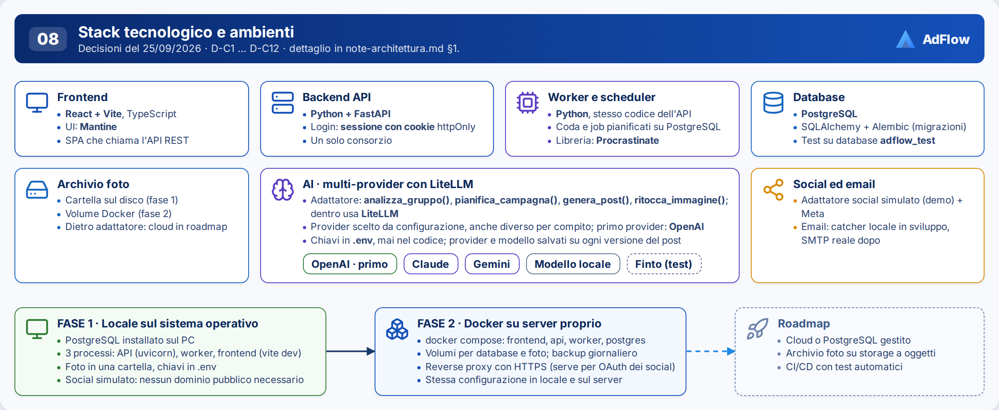
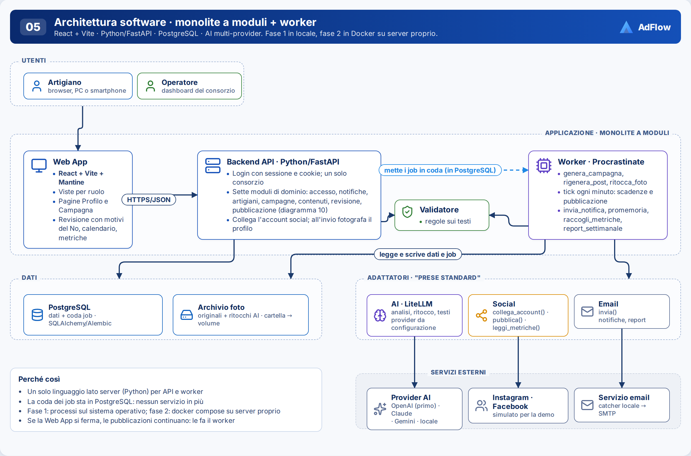
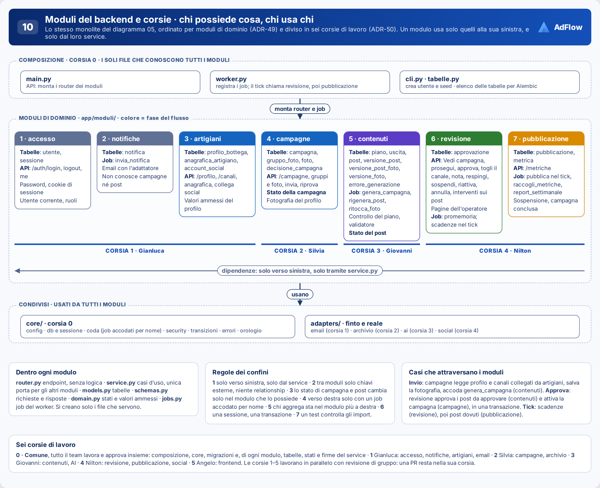
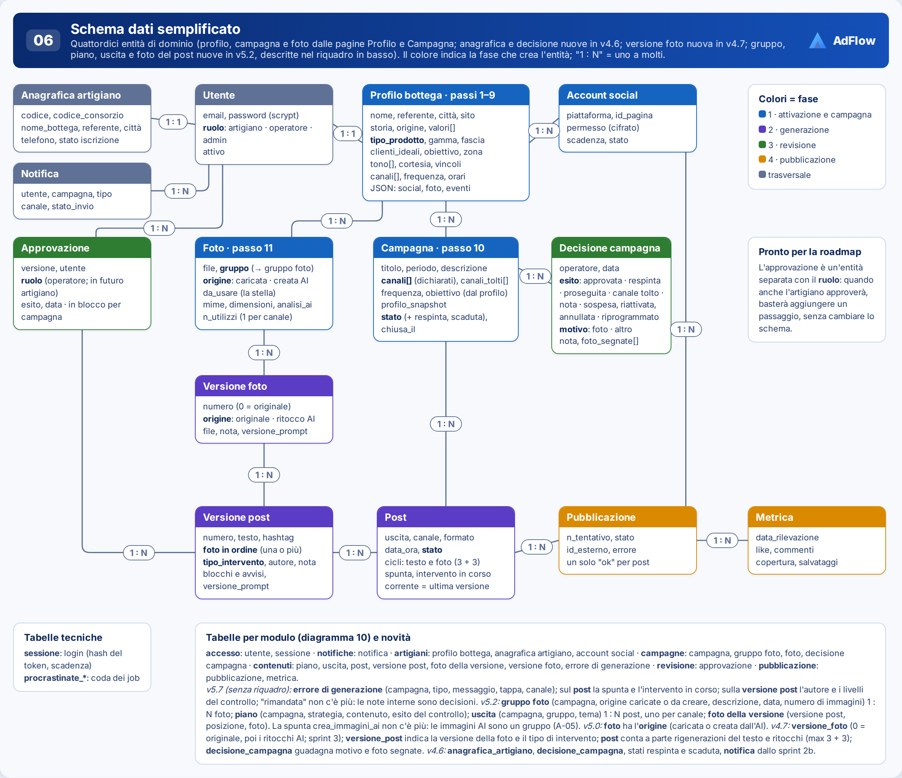
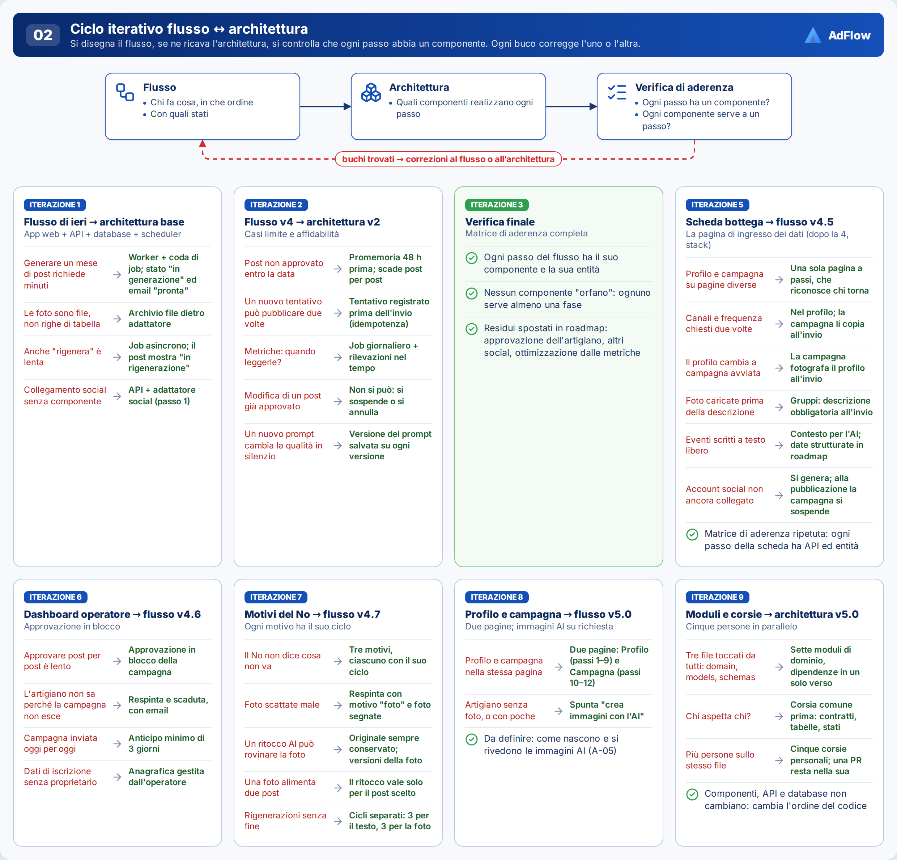

# Note sull'architettura · AdFlow Suite

Appunti che spiegano l'architettura disegnata nella cartella `architettura/` (diagrammi 02, 05, 06, 08, 10), con il perché delle scelte tecniche. Il dettaglio per gli agenti (modello dati, API, job) sta in `docs/agenti/plan.md`; decisioni, con il perché, in [`ADR.md`](ADR.md); rischi e punti da verificare in [`lavori-aperti.md`](lavori-aperti.md). Versione 5.2 del 06/10/2026: canali sulla campagna, gruppi, piano editoriale e uscite (ADR-57…70); documento ridotto (ADR-72).

Si parte **da zero** nel repository del team (ADR-45): ogni tabella nasce già nella sua forma definitiva, nello sprint indicato in `docs/agenti/plan.md` §2, senza migrazioni "di passaggio".

---

## 1. Stack e ambienti

| Livello | Scelta | Note |
|---|---|---|
| Frontend | React + Vite, TypeScript, **Mantine** | SPA; in sviluppo Vite inoltra `/api` al backend |
| Backend API | Python 3.11+ · FastAPI · Pydantic | Documentazione interattiva su `http://localhost:8000/docs` |
| Worker e scheduler | Python + **Procrastinate**, stesso codice dell'API | Coda e job pianificati dentro PostgreSQL |
| Database | PostgreSQL 16 · SQLAlchemy 2 + Alembic | Migrazioni versionate |
| Archivio foto | Cartella locale → volume Docker | Dietro adattatore; storage a oggetti in roadmap |
| AI | LiteLLM, multi-provider | Primo provider reale: OpenAI; provider **finto** per sviluppo e test |
| Autenticazione | Sessione con cookie httpOnly | Ruoli: artigiano, operatore, admin; un solo consorzio |
| Social | Simulato + Meta | Simulato in fase 1 e in demo |
| Email | Catcher locale (es. Mailpit) → SMTP reale | Nessuna email vera durante lo sviluppo |
| Test | pytest su database `adflow_test`, per modulo e per percorso; 1 test end-to-end finale | ADR-11, §3.2 |

| Fase | Come gira | Quando |
|---|---|---|
| **1 · Locale** | PostgreSQL installato; tre processi: API (`uvicorn`), worker, frontend (`vite dev`); foto in una cartella; chiavi in `.env`; social simulato | Sviluppo e demo |
| **2 · Docker su server proprio** | `docker compose` con frontend, api, worker, postgres; volumi per database e foto; backup giornaliero; reverse proxy con HTTPS | Quando il flusso funziona in locale |
| Roadmap | Cloud o PostgreSQL gestito, storage a oggetti, CI/CD | Dopo il progetto |

**Configurazione**: le variabili di `backend/.env` sono elencate in `docs/agenti/plan.md` §1 e in `backend/.env.example`.

**Scelte tecniche**: con motivazione e alternative scartate stanno in [`ADR.md`](ADR.md), righe 01–11, 49 e 50 (alias da D-A a D-C14).

## 2. Architettura

| Componente | Cosa fa | Con chi parla | Se si rompe |
|---|---|---|---|
| **Web App** | Viste per ruolo. Artigiano: pagina Profilo bottega e pagina Campagna (canali, gruppi di foto; dopo l'invio: stato, piano approvato con calendario in lettura, metriche). Operatore: ingresso, campagne da approvare, elenco artigiani, nuovo artigiano, pagina artigiano, campagne chiuse, Vedi campagna (piano, uscite con i post dei canali, decisioni in blocco, motivi del No, interventi AI), metriche. Mappa in `pagine/index.html` | Backend API | Nessuna azione possibile, ma le pubblicazioni continuano |
| **Backend API** | Sette moduli di dominio (§3): accesso, notifiche, artigiani, campagne, contenuti, revisione, pubblicazione. All'invio ricontrolla minimi e canali collegati, copia frequenza e obiettivo e salva `profilo_snapshot`. Mette i job in coda | DB, archivio, adattatori | L'app si ferma; il worker continua |
| **Worker** | Esegue i job dei moduli (elenco in `docs/agenti/plan.md` §4); quelli della campagna leggono `profilo_snapshot`. La generazione lavora a tappe e salva man mano: un nuovo tentativo riparte da dove si era fermata | DB, archivio, adattatori | I job restano in coda: solo ritardo |
| **PostgreSQL** | Tutti i dati + coda dei job | API, worker | Tutto fermo: backup giornalieri |
| **Archivio foto** | Originali, ritocchi AI, immagini create dall'AI, ritagli | API, worker | Generazione e pubblicazione ferme |
| **Validatore** | Regole verificabili: sui testi (limiti della scheda del canale, parole vietate, "cose da non dire", niente prezzi o premi inventati) e sul piano (limiti di capacità, date, foto ripetute). Sta nel modulo `contenuti` | API, worker | Post "da rivedere", mai pubblicato senza controllo; piano debole fermato dall'operatore |
| **Adattatore AI** | `analizza_gruppo()`, `pianifica_campagna()`, `genera_post()`, `ritocca_immagine()`, `crea_immagine()` (da pianificare, A-05); provider e modello da configurazione; prompt per tipo di prodotto e per canale, con versione | Provider AI | Nuovo tentativo, poi "da rivedere" o "generazione fallita" |
| **Adattatore social** | `collega_account()`, `pubblica()` con una o più foto, `leggi_metriche()`; implementazioni Meta e **simulata** | Social | Nuovo tentativo, "fallito" o "account da ricollegare" |
| **Adattatore email** | `invia()`; notifiche e report | Catcher locale / SMTP | Notifica salvata e reinviata |

I componenti non cambiano con la struttura a moduli: restano un'API e un worker con lo stesso codice, un database, un deploy (ADR-01). Cambia **come è ordinato il codice dentro** il backend.

## 3. Struttura a moduli del backend

### 3.1 Perché

Il repository riparte dai soli documenti (ADR-51): l'impalcatura iniziale di `backend/` e `frontend/` è stata cancellata e il codice nasce con i task T1-01 e T1-51. Il primo scheletro del backend, rimasto su due branch che non vengono uniti (ADR-50), era ordinato **per strato tecnico**: `api/`, `services/`, `worker/` e tre file unici per tutto il dominio, `domain.py`, `models.py`, `schemas.py`. Con 15 tabelle e 5 persone quei tre file li avrebbero toccati tutti.

Il backend nasce quindi ordinato **per modulo di dominio** (ADR-49, D-C13): ogni modulo tiene insieme i suoi endpoint, i suoi casi d'uso, le sue tabelle e i suoi stati. Resta un monolite: i moduli sono cartelle dello stesso programma, non servizi separati.

### 3.2 Cartelle e file di un modulo

L'albero delle cartelle sta in `docs/agenti/constitution.md` §2.

Dentro ogni modulo, solo i file che servono:

| File | Contenuto |
|---|---|
| `router.py` | Endpoint FastAPI: legge la richiesta, chiama il service, restituisce lo schema. Nessuna logica |
| `service.py` | Casi d'uso del modulo. È **l'unica porta** per gli altri moduli |
| `models.py` | Tabelle SQLAlchemy del modulo |
| `schemas.py` | Schemi Pydantic di richieste e risposte |
| `domain.py` | Stati, transizioni e valori ammessi che appartengono al modulo |
| `jobs.py` | Job del worker del modulo: aprono la sessione, chiamano il service |

### 3.3 I sette moduli

L'ordine della tabella è l'ordine delle dipendenze: **un modulo può usare solo quelli che lo precedono**.

| # | Modulo | Fase | Tabelle | API | Job | Usa |
|---|---|---|---|---|---|---|
| 1 | `accesso` | trasversale | utente, sessione | `/auth/login`, `/auth/logout`, `/auth/me` | — | — |
| 2 | `notifiche` | trasversale | notifica | — | `invia_notifica` | accesso |
| 3 | `artigiani` | 1 | profilo_bottega, anagrafica_artigiano, account_social | `/profilo`, `/canali`; creazione, anagrafica e collegamento social di `/artigiani` | — | accesso |
| 4 | `campagne` | 1 | campagna, gruppo_foto, foto, decisione_campagna | `/campagne` (bozza, elenco, dettaglio, modifica), gruppi e foto, `/invia`, `/riprova` | — | accesso, artigiani |
| 5 | `contenuti` | 2 | piano, uscita, post, versione_post, versione_post_foto, versione_foto, errore_generazione | `/campagne/{id}/calendario` (sprint 3) | `genera_campagna`, `rigenera_post`, `ritocca_foto` | notifiche, campagne |
| 6 | `revisione` | 3 | approvazione | `/campagne/{id}/post`, `/prosegui`, `/approva`, `/togli-canale`, `/nota`, `/respingi`, `/sospendi`, `/riattiva`, `/annulla`, `/post/{id}/modifica`, `/post/{id}/rigenera`, `/post/{id}/controllato`, `/post/{id}/riprogramma`, `/ritocca-foto`, `/scegli-foto`, `/cambia-foto`, `/sposta`; `/da-approvare`, elenco e pagina artigiano dell'operatore | `promemoria`; scadenze nel tick | accesso, notifiche, artigiani, campagne, contenuti |
| 7 | `pubblicazione` | 4 | pubblicazione, metrica | `/metriche` | pubblicazione nel tick, `raccogli_metriche`, `report_settimanale` | accesso, notifiche, artigiani, campagne, contenuti |

Che cosa possiede ogni modulo, oltre alle tabelle:

- **accesso**: password (scrypt), sessione con cookie, le dipendenze "utente corrente" e "richiede ruolo" usate da tutti i router.
- **notifiche**: crea la riga di notifica e la spedisce con l'adattatore email. Riceve solo identificativi e testi: non conosce campagne né post.
- **artigiani**: il profilo dei passi 1–9, l'anagrafica dell'operatore, gli account social (dallo sprint 1: dicono quali canali una campagna può dichiarare). Valori ammessi del profilo (tipo di prodotto, tono, canali, frequenza…).
- **campagne**: la bozza con i suoi canali, i gruppi di foto (caricate o da creare) e, con loro, l'archivio della bottega (gruppi e foto senza campagna, ADR-83 e ADR-86: le tabelle sono pronte dallo sprint 1, il caricamento dal profilo arriva con la 2a), l'invio con la fotografia del profilo, lo **stato della campagna** e lo storico delle decisioni. `cambia_stato()` è l'unica funzione che modifica lo stato di una campagna.
- **contenuti**: il piano editoriale e le uscite, i post e le loro versioni con le foto, le versioni delle foto, i limiti di capacità e il controllo del piano, i riempitivi con la composizione delle cartoline (ADR-88), la scheda dei canali, il validatore, la generazione a tappe e le rigenerazioni con l'AI. Possiede lo **stato del post**.
- **revisione**: tutto ciò che fa l'operatore su una campagna (Vedi campagna, prosegui, approva, togli il canale, nota interna, respingi, sospendi, riattiva e annulla, interventi sui post), la scadenza e il promemoria, e le pagine dell'operatore che mettono insieme più moduli.
- **pubblicazione**: i tentativi di pubblicazione, la sospensione per account mancante, la chiusura della campagna, le metriche e il report.

`decisione_campagna` sta in `campagne` e non in `revisione` perché è lo storico della campagna: lo leggono anche il dettaglio della campagna e il Bentornato (ultima respinta), che vengono prima. `revisione` lo scrive passando dal service di `campagne`.

### 3.4 Cosa resta condiviso

| Dove | Cosa | Perché non sta in un modulo |
|---|---|---|
| `core/config.py`, `db.py` | Configurazione, motore, sessione, `Base` | Servono a tutti |
| `core/coda.py` | Applicazione Procrastinate, nomi dei job, `accoda(nome, …)` | Permette di accodare un job di un modulo successivo senza importarlo |
| `core/security.py` | scrypt, token, hash | Funzioni pure, usate da `accesso`, dal seed e dalla CLI |
| `core/transizioni.py` | `verifica_transizione(tabella, da, a)` | Una sola funzione di controllo; le tabelle delle transizioni restano nei `domain.py` di `campagne` e `contenuti` |
| `core/errori.py`, `orologio.py` | Errori di dominio → 401/403/404/409/422; "adesso" iniettabile | Stesso comportamento in ogni modulo |
| `adapters/` | AI, social, email, archivio | Sono prese verso l'esterno, non dominio; ognuna ha la sua implementazione finta |
| `alembic/` | Una sola catena di migrazioni | Il database è uno |

### 3.5 Regole dei confini

1. **Solo all'indietro, solo dal service.** Un modulo importa da un altro modulo soltanto `service` (e gli schemi che il service restituisce), e soltanto se l'altro lo precede nella tabella del §3.3. Mai `models`, `router` o `jobs` di un altro modulo.
2. **Tra moduli solo chiavi esterne.** Le tabelle si collegano con `ForeignKey("tabella.id")`; le `relationship()` restano dentro il modulo. Per avere i dati di un altro modulo si chiama il suo service con l'identificativo; ciò che torna si legge, non si modifica.
3. **Lo stato ha un solo proprietario.** Lo stato della campagna cambia solo in `campagne.service.cambia_stato()`, quello del post solo in `contenuti`; entrambi passano da `verifica_transizione()`.
4. **In avanti solo con un job.** Quando un modulo deve far partire qualcosa in un modulo successivo, accoda un job per nome con `core.coda.accoda()`. È il caso dell'invio: `campagne` accoda `genera_campagna`, che appartiene a `contenuti`.
5. **Chi aggrega sta in fondo.** Un endpoint o un job che mette insieme più moduli vive nel modulo più avanti tra quelli che gli servono. La pagina artigiano dell'operatore (anagrafica + campagne + conteggi dei post) sta in `revisione`, anche se il percorso comincia con `/artigiani`.
6. **Una sessione, una transazione.** La sessione del database la apre chi sta al bordo (il router o il job) e la passa ai service; i service non fanno `commit`. Un caso d'uso che attraversa tre moduli resta una transazione sola.
7. **La composizione sta fuori dai moduli.** Solo `main.py`, `worker.py`, `cli.py` e `tabelle.py` conoscono tutti i moduli.

Le regole 1 e 7 le controlla un test (`tests/test_confini.py`) che legge gli `import` di ogni modulo: se qualcuno importa in avanti, o importa i `models` di un altro, il test fallisce. Nessuna libreria nuova.

### 3.6 Contratti tra moduli

Il **contratto** di un modulo è l'elenco delle funzioni del suo `service.py` che gli altri possono chiamare, con nome, argomenti e risultato. L'elenco, con chi usa ogni funzione e in quale task viene scritta, sta solo nel canale agenti: `docs/agenti/plan.md` §6. Le firme si decidono insieme (corsia 0) e sono nel codice dal primo giorno, anche se vuote: chi sta a valle scrive contro la firma, chi sta a monte la riempie.

Insieme ai contratti ogni modulo offre le **fabbriche di test** (`tests/moduli/<modulo>/fabbrica.py`): funzioni che creano i suoi dati già nello stato che serve (`campagna_in_revisione()`, `post_approvato()`…). I test degli altri moduli preparano i dati con quelle, senza toccare le tabelle altrui.

### 3.7 I casi che attraversano i moduli

| Caso | Dove vive | Cosa chiama |
|---|---|---|
| **Invio** della campagna | `campagne` | `artigiani.service` per il profilo e i canali collegati → controlla minimi e canali → copia frequenza e obiettivo e salva lo snapshot → `cambia_stato(inviata)` → `accoda("genera_campagna")` |
| **Generazione** | job di `contenuti` | A tappe, ognuna salvata prima della successiva: `campagne.service` per snapshot, gruppi e foto → analisi dei gruppi, salvata con `campagne.service.aggiorna_foto()` → piano dell'AI, controllo del piano, uscite e post → se il piano è debole `campagne.cambia_stato(piano_da_rivedere)` e ci si ferma → testo di ogni post, validatore, versioni → `campagne.cambia_stato(in_revisione)` oppure `generazione_fallita` |
| **Prosegui** | `revisione` | da `piano_da_rivedere`: controlla con `contenuti.service` che il piano abbia dei post → `campagne.service` registra la decisione e `cambia_stato(in_generazione)` → `accoda("genera_campagna")`, che riparte dai testi |
| **Riprova** | `campagne` | `cambia_stato(inviata)` → `accoda("genera_campagna")`, che non rifà le tappe già salvate |
| **Approva** | `revisione` | `contenuti.service` approva i post da approvare (quelli con la data passata scadono) → scrive le righe `approvazione` → `campagne.service` registra la decisione e `cambia_stato(attiva)` |
| **Togli il canale** | `revisione` | `contenuti.service` scarta i post di quel canale → `campagne.service` segna il canale tolto e registra la decisione |
| **Respingi** | `revisione` | `contenuti.service` scarta i post → `campagne.service` registra la decisione e `cambia_stato(respinta)` → `notifiche.service` crea l'email |
| **Rigenera / ritocca** | `revisione` | controlla stato e cicli con `contenuti.service` → `accoda("rigenera_post")` o `accoda("ritocca_foto")` |
| **Tick ogni minuto** | `worker.py` | prima `revisione.service` (scadenze), poi `pubblicazione.service` (post dovuti) |
| **Pubblicazione** | `pubblicazione` | `contenuti.service` per i post approvati con le loro foto → `artigiani.service` per l'account → adattatore social → `contenuti` segna pubblicato o fallito → `campagne.cambia_stato(conclusa / sospesa)` → `notifiche` |
| **Bentornato** | `campagne` | profilo da `artigiani.service`, ultima decisione dal proprio storico |

La struttura a moduli non cambia l'API vista dal frontend: decide solo in quale cartella sta il codice di ogni endpoint. Gli endpoint, con le novità del 06/10 (canali, gruppi, Prosegui, Togli il canale), sono in `docs/agenti/plan.md` §3.

### 3.8 Frontend

Segue la stessa idea, in forma leggera: `src/api/` con un file per modulo del backend (i tipi rispecchiano gli `schemas.py` di quel modulo) e `src/api/esempi/` con i dati di esempio, `src/pages/artigiano/` e `src/pages/operatore/` per le pagine dei due ruoli, `src/components/` per ciò che è condiviso. `auth.tsx` resta unico.

### 3.9 Lavorare in cinque: sei corsie

L'obiettivo della divisione è che **cinque persone lavorino senza toccare gli stessi file** (ADR-50, D-C14). Le corsie sono sei: una **comune**, dove il team lavora e approva insieme, e cinque **personali**, che procedono in parallelo e hanno bisogno solo della revisione di gruppo.

| Corsia | Chi | Di sua proprietà | Sprint 1 |
|---|---|---|---|
| **0 · Comune** | tutto il team | `core/`, `main.py`, `worker.py`, `cli.py`, `tabelle.py`, `alembic/`; di ogni modulo le tabelle (`models.py`), gli stati (`domain.py`) e le funzioni del contratto usate da più corsie; `tests/percorsi/`, test dei confini, fabbriche di test | Struttura, contratti, tabelle, stati e letture comuni, coda e worker, seed, riallineamento al modello del 06/10, chiusura |
| **1 · Accesso e artigiani** | Gianluca | `moduli/accesso/`, `moduli/notifiche/`, `moduli/artigiani/`, `adapters/email/` | Login, permessi, creazione utenti, canali collegati |
| **2 · Campagne** | Silvia | `moduli/campagne/`, `adapters/archivio/` | Archivio, bozza con i canali, gruppi e foto, invio e Riprova |
| **3 · Contenuti** | Giovanni | `moduli/contenuti/`, `adapters/ai/` | AI finta, limiti e controllo del piano, validatore, generazione a tappe |
| **4 · Revisione e pubblicazione** | Nilton | `moduli/revisione/`, `moduli/pubblicazione/`, `adapters/social/` | Social simulato, Vedi campagna con Approva e Prosegui, pubblicazione |
| **5 · Frontend** | Angelo | `frontend/` | Login, pagina Campagna dell'artigiano, pagine minime dell'operatore |

**Il principio:** tutto ciò che più di una corsia usa sta nella corsia 0. Per questo, finita la fase comune, nessuna corsia personale aspetta un'altra.

**Corsia 0.** I primi sei task si fanno all'inizio, insieme; T1-08 e T1-09 riallineano ciò che è già su `main` alle decisioni del 06/10 e vengono prima delle corsie; T1-07 alla fine.

I task della corsia 0, con che cosa si fa in ognuno e in quale ordine, stanno in `docs/agenti/tasks.md`. Sono comuni per un motivo solo: toccano ciò che più corsie usano (struttura, firme, tabelle, stati, coda, seed) oppure sono il punto in cui le corsie si incontrano (chiusura).

**Corsie 1–5.** Partono quando i task T1-01…T1-06, T1-08 e T1-09 sono su `main`. Ogni corsia comincia da un task che non dipende dagli altri (un adattatore, una funzione pura, il login) e finisce con il suo task più grosso: invio per la 2, generazione per la 3, pubblicazione per la 4. Nessun task di una corsia personale aspetta un'altra corsia: aspetta solo la corsia 0. Fa eccezione il frontend, che per passare alle API vere aspetta l'invio (2) e l'approvazione (4).

I task, con identificativi, letture e criteri di accettazione, stanno solo nel canale agenti: `docs/agenti/tasks.md`.

Che cosa tiene separate le corsie personali:

1. **Contratti scritti prima** (T1-02) e **fabbriche di test** (§3.6): la corsia 4 prova l'approvazione su una campagna "già in revisione" senza aspettare invio e generazione.
2. **Utente di prova** (T1-06): i test delle API non aspettano il login.
3. **Composizione chiusa**: chi aggiunge un endpoint scrive solo nel `router.py` del suo modulo.
4. **Frontend sul contratto dell'API**: dati di esempio con la stessa forma finché l'endpoint non è su `main`.
5. **Una PR resta nella sua corsia.** Se serve cambiare una tabella, uno stato, una funzione del contratto o `core/`, nasce un nuovo task della corsia 0.

**Revisione.** Corsia 0: la PR si unisce solo con l'approvazione di tutti. Corsie 1–5: revisione di gruppo, poi unisce l'admin.

Negli sprint successivi le corsie restano le stesse: profilo e notifiche alla 1, Bentornato e sospensione alla 2, rigenerazioni e ritocco alla 3, motivi del No e pagine dell'operatore alla 4, le pagine alla 5; tabelle, stati e funzioni condivise alla corsia 0.

### 3.10 Punti di forza e punti deboli

| Punti di forza | Punti deboli e come si tengono a bada |
|---|---|
| Ogni persona lavora in una cartella: spariscono i tre file toccati da tutti | Il dominio è intrecciato (approvare tocca campagna, post, approvazione, decisione): servono confini decisi prima → tabella del §3.7 |
| Un task corrisponde a un modulo: brief e revisione più corti | Stati e transizioni non sono più in un file solo → regola 3: un solo proprietario per stato, una sola `verifica_transizione()` |
| Le dipendenze sono scritte e controllate da un test | Le migrazioni restano un punto unico → tutte nella corsia 0 |
| I test di un modulo girano da soli | Più cartelle e più file piccoli → dentro il modulo si creano solo i file che servono |
| Non cambia nulla per chi usa il sistema: stessi componenti, stessa API, stesso deploy | Nella fase comune non c'è parallelismo: sei task fatti in cinque sono lenti → in cambio i contratti sono condivisi e dopo non ci sono attese |

## 4. Modello dati, API e job

Il dettaglio (tabelle, stati, valori ammessi, endpoint, job, con lo sprint in cui nasce ogni pezzo) sta in `docs/agenti/plan.md`. Qui resta la vista d'insieme; a quale modulo appartiene ogni tabella è nel §3.3.

## 5. Aderenza flusso → architettura

Metodo (diagramma 02): si disegna il flusso, se ne ricava l'architettura, si verifica che **ogni passo abbia un componente** e che **ogni componente serva a un passo**. Ogni buco corregge l'uno o l'altra; le iterazioni fatte finora, fino alla 8, sono nel diagramma. La struttura a moduli non nasce da un buco del flusso: riordina il codice, e la tabella qui sotto guadagna la colonna del modulo.

| Passo (note-flusso) | Componenti | Modulo | Entità |
|---|---|---|---|
| 1.0 Accesso | Web App, API | accesso | utente, sessione, profilo_bottega |
| 1.1–1.1b Pagina Profilo e Bentornato | Web App, API | artigiani, campagne | profilo_bottega, decisione_campagna (ultima respinta) |
| 1.2 Account social | API, adattatore social | artigiani | account_social (dallo sprint 1, dal seed) |
| 1.3–1.5 Pagina Campagna: bozza, canali, gruppi, foto | Web App, API, archivio | campagne (canali collegati da artigiani) | campagna, gruppo_foto, foto |
| 1.6 Invio | API, worker (coda) | campagne | campagna (`profilo_snapshot`) |
| 2.1–2.3 Analisi dei gruppi, piano, controllo del piano | worker, adattatore AI, validatore | contenuti | foto (analisi), piano, uscita, post |
| 2.4–2.5 Ritocco e creazione immagini | worker, adattatore AI, archivio | contenuti | versione_foto, foto |
| 2.6–2.7 Post e controllo a regole | worker, adattatore AI, validatore | contenuti | versione_post, versione_post_foto |
| 2.8 Campagna pronta | worker, adattatore email | contenuti, notifiche | notifica |
| 3.1 Dashboard operatore | Web App, API | revisione | anagrafica_artigiano, campagna |
| 3.2–3.3 Vedi campagna, piano da rivedere e interventi | Web App, API, worker, validatore, adattatore AI | revisione, campagne, contenuti | piano, uscita, post, versione_post, versione_post_foto, versione_foto |
| 3.4 Decisione | Web App, API, adattatore email | revisione | decisione_campagna, approvazione, notifica |
| 3.5 Promemoria e scadenza | worker, adattatore email | revisione | campagna, post, notifica |
| 3.6 Sospendi / annulla | Web App, API | campagne | campagna |
| 4.1–4.4 Pubblicazione | worker, adattatore social, adattatore email | pubblicazione | pubblicazione, account_social |
| 4.5 Metriche e report | worker, adattatore social, Web App | pubblicazione | metrica |
