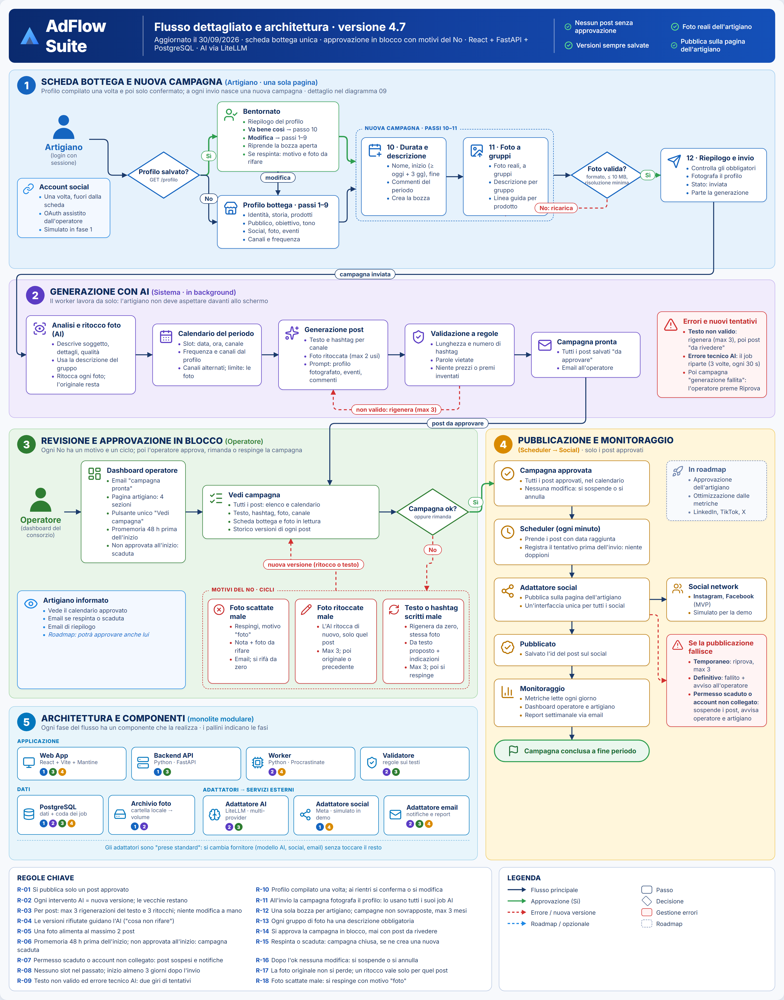
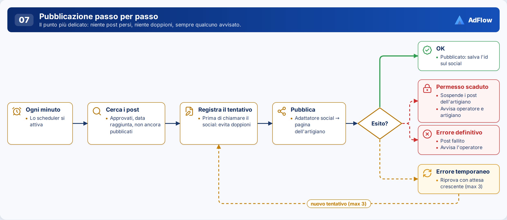
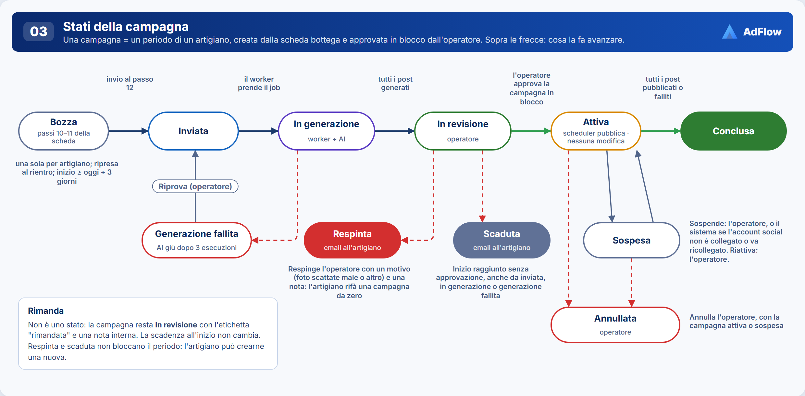
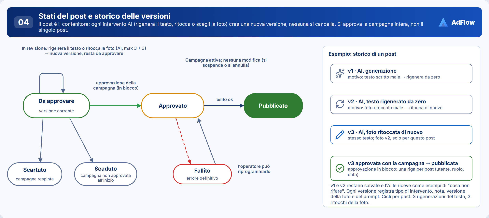

# Note sul flusso · AdFlow Suite

Appunti che spiegano il flusso disegnato nella cartella `architettura/` (diagrammi 01, 03, 04, 07, 09 e pagine statiche), con il perché delle decisioni. Materiale in continua rimodulazione. La versione breve per gli agenti è `docs/agenti/spec.md` (vedi `LEGGIMI.md`); l'architettura è spiegata in [`note-architettura.md`](note-architettura.md); ciò che è ancora aperto sta in [`lavori-aperti.md`](lavori-aperti.md).

**Versione:** 4.7 del 30/09/2026 · **Autore:** B3 · Architetto software · Diagrammi in `architettura/diagrammi/` (sorgente `architettura/AdFlow-diagrammi.html`).

---

## 1. Problema e obiettivo

Gli artigiani di un consorzio non hanno tempo né competenze per pubblicare con regolarità sui social. AdFlow Suite trasforma **le loro foto reali** e **il racconto della loro bottega** in un calendario di post per Facebook e Instagram. Un **operatore del consorzio** controlla tutto prima che esca: nessun post viene pubblicato senza la sua approvazione.

In sintesi:
- l'artigiano compila una volta la **scheda della bottega** e, per ogni periodo, crea una **campagna** con le sue foto;
- l'AI analizza e ritocca le foto e scrive **tutti i post del periodo**; un controllo a regole verifica i testi;
- l'operatore rivede la campagna: se qualcosa non va sceglie **il motivo del No** e il suo ciclo, poi **approva, rimanda o respinge** la campagna intera;
- i post approvati si pubblicano da soli, alle date stabilite, sulla **pagina social dell'artigiano**; poi si raccolgono le metriche.

## 2. Attori

| Attore | Chi è | Cosa fa |
|---|---|---|
| **Artigiano** | Titolare di una bottega iscritta al consorzio | Compila il profilo, crea e invia le campagne con le foto, vede il calendario approvato e le metriche |
| **Operatore** | Persona del consorzio | Gestisce anagrafica e account social degli artigiani, rivede le campagne, decide su ognuna |
| **Admin** | Amministratore del sistema | Crea operatori, configura il sistema |
| **Sistema** | Processi automatici | Genera i post, controlla scadenze, pubblica, raccoglie metriche, invia email |

C'è **un solo consorzio**.

---

## 3. Fase 1 · Scheda bottega e nuova campagna (artigiano)

Profilo e campagna sono **un'unica pagina a passi** (D-08), divisa in tre parti. Schema di riferimento: `architettura/AdFlow-scheda-bottega.html`; diagramma 09.

| Parte | Passi | Contenuto | Quando si salva |
|---|---|---|---|
| A · Profilo bottega | 1–9 | Identità, storia, prodotti (**tipo di prodotto** da elenco), pubblico e obiettivo, voce e vincoli ("cose da non dire mai"), presenza social attuale, politica foto, calendario eventi ricorrenti, logistica (canali, frequenza, orari) | Lasciando il passo 9 |
| B · Nuova campagna | 10–11 | Nome, inizio, fine, commenti del periodo; foto caricate a **gruppi**, con una descrizione per gruppo | Lasciando il passo 10 nasce la **bozza**; ogni foto appena caricata; la descrizione mentre si scrive |
| C · Riepilogo | 12 | Rilettura, campi obbligatori mancanti evidenziati, un solo invio | Controlla e invia |

| # | Passo | Cosa succede |
|---|---|---|
| 1.0 | Accesso | L'artigiano entra con le sue credenziali. Se il profilo esiste va al Bentornato, altrimenti al passo 1 |
| 1.1 | Profilo · passi 1–9 *(una volta)* | Compila la parte A |
| 1.1b | **Bentornato** *(ai rientri)* | Riepilogo del profilo: **Va bene così** → passo 10 senza salvare nulla; **Modifica** → passo 1 già compilato. Riprende la bozza aperta. Se l'ultima campagna è stata respinta mostra **motivo, richiesta di modifica e foto da rifare** (D-09, D-23, D-30) |
| 1.2 | Account social *(una volta, fuori dalla scheda)* | L'artigiano autorizza la sua pagina insieme all'operatore. Non blocca l'invio (D-15) |
| 1.3 | Nuova campagna · passo 10 | Inizio **almeno 3 giorni dopo oggi**, durata massima **3 mesi**, periodo non sovrapposto ad altre sue campagne (D-14, D-25) |
| 1.4 | Foto a gruppi · passo 11 | Foto reali caricate subito; una descrizione per gruppo, obbligatoria all'invio; linea guida per tipo di prodotto (Appendice A) (D-10) |
| 1.5 | Controllo tecnico foto | Al caricamento: JPG, PNG o WEBP, al massimo 10 MB, lato corto almeno 1080 px; altrimenti si ricarica. Luce e nitidezza sono solo segnalate dall'AI all'operatore (D-17) |
| 1.6 | Riepilogo e invio · passo 12 | Controlla gli obbligatori, copia nella campagna canali, frequenza e obiettivo del profilo e ne salva una **fotografia**; la generazione parte da sola (D-12, D-13, D-18) |

**Obbligatori.** Profilo: nome bottega, referente, città, tipo di prodotto, clienti ideali, obiettivo, canali di pubblicazione. Campagna: nome, inizio, fine, commenti. Foto: almeno un gruppo, ciascuno con la sua descrizione (R-13).

**Perché la fotografia del profilo.** Il profilo può cambiare mentre una campagna è in corso. La campagna usa sempre il profilo com'era all'invio: la modifica vale dalla campagna successiva, e l'operatore vede esattamente ciò che ha ricevuto l'AI (D-13).

**Anticipo minimo.** L'inizio deve cadere almeno 3 giorni dopo oggi; il controllo si ripete all'invio, perché una bozza lasciata ferma può non rispettarlo più. Serve all'operatore per rivedere prima della scadenza (D-24, D-25).

**Senza account social** la campagna si genera e si rivede normalmente; alla prima pubblicazione passa a "sospesa" e partono le notifiche (R-07).

## 4. Fase 2 · Generazione con AI (sistema)

| # | Passo | Cosa succede |
|---|---|---|
| 2.1 | Analisi foto | L'AI descrive soggetto, dettagli e qualità di ogni foto, usando la descrizione del gruppo; segnala problemi di luce o nitidezza |
| 2.1b | Ritocco foto | L'AI ritocca ogni foto; l'originale resta sempre (D-31). *Che cosa fa il ritocco e con quali istruzioni lo decide un task di analisi* (lavori-aperti.md A-01) |
| 2.2 | Calendario del periodo | Numero di post = il minore tra (post a settimana × settimane) e (foto × 2). I canali scelti si alternano; gli orari preferiti sono un'indicazione (D-19, R-05) |
| 2.3 | Generazione post | Testo e hashtag per canale, foto ritoccata abbinata, istruzioni per tipo di prodotto con la fotografia del profilo, eventi, chiusure e commenti del periodo (D-16) |
| 2.4 | Controllo a regole | Lunghezza, numero di hashtag, parole vietate (comprese le "cose da non dire" del profilo), niente prezzi o premi inventati. Se non va si riscrive (max 3), poi il post è **"da rivedere"** |
| 2.5 | Campagna pronta | Post "da approvare", campagna "in revisione", email all'operatore |
| 2.6 | Errore tecnico dell'AI | Si riprova da soli (3 volte in tutto). Se fallisce anche la terza: campagna "generazione fallita"; l'operatore preme **Riprova** (R-09) |

## 5. Fase 3 · Revisione e approvazione in blocco (operatore)

| # | Passo | Cosa succede |
|---|---|---|
| 3.1 | Dashboard operatore | Elenco artigiani; pagina artigiano con le campagne in quattro sezioni e un solo pulsante **Vedi campagna**; promemoria 48 ore prima dell'inizio (D-29) |
| 3.2 | Vedi campagna | Tutti i post in ogni stato, in elenco e in calendario: testo, hashtag, foto, canale, storico versioni; scheda bottega (fotografia) e foto in sola lettura |
| 3.3 | Sistemare i post | Se un post non va, si sceglie il motivo e il suo ciclo (tabella sotto). Ogni intervento crea una nuova versione, che ripassa il controllo a regole. **Niente modifica a mano** (D-32) |
| 3.4 | Decisione sulla campagna | **Approva**: tutti i post approvati, campagna attiva (non se un post è "da rivedere" o ha un intervento in corso). **Rimanda**: etichetta e nota interna, nessun cambio di stato. **Respingi**: motivo e nota obbligatori, email all'artigiano (D-20, D-22, D-23, D-30) |
| 3.5 | Scadenza | Nessuna approvazione entro le 00:00 del giorno di inizio: campagna **scaduta**, post scaduti, email all'artigiano (D-24) |
| 3.6 | Dopo l'approvazione | **Nessuna modifica** ai post. Se uno non va più bene: sospendi o annulla; riattiva dopo una sospensione (D-34) |
| 3.7 | Artigiano informato | Calendario approvato in sola lettura, email di riepilogo; email per respinta e scadenza |

### 5.1 Motivi del No e cicli

| Motivo | Dove agisce | Ciclo | Limite | Quando i cicli finiscono |
|---|---|---|---|---|
| **Foto scattate male** (buie, mosse, soggetto sbagliato) | Campagna intera | **Respingi** con motivo "foto": nota obbligatoria e foto da rifare segnate; email all'artigiano con le miniature. La campagna resta "respinta" nello storico; l'artigiano ne crea una nuova con foto nuove | — | — |
| **Foto ritoccate male dall'AI** | Singolo post | **Ritocca di nuovo**, con nota facoltativa: nuova versione della foto **solo per quel post**, anche se la stessa foto alimenta un altro post | 3 ritocchi per post | Si sceglie la foto originale o una versione precedente (non consuma cicli) |
| **Testo o hashtag coerenti ma scritti male** | Singolo post | ① **Rigenera da zero**, con la stessa foto · ② **Rigenera da un testo proposto** dall'operatore più indicazioni, con la stessa foto | 3 rigenerazioni per post (① e ② insieme) | Resta solo **Respingi** con motivo "altro" |
| Altro | Campagna intera | **Respingi** con motivo "altro" e nota | — | — |

Le versioni rifiutate diventano esempi di "cosa non rifare" per l'AI (R-04). Un post "da rivedere" si sblocca solo con un nuovo intervento. Quando tutti i post vanno bene, l'operatore approva in blocco.

### 5.2 Dashboard operatore

Quattro pagine: **elenco artigiani**, **pagina artigiano**, **Vedi campagna**, **metriche**. Schema della pagina artigiano: `architettura/AdFlow-operatore-artigiano.html`.

| Parte della pagina artigiano | Contenuto | Chi la scrive |
|---|---|---|
| Anagrafica | Codice artigiano, codice consorzio, nome bottega, referente, città, email di accesso, telefono, iscrizione | Solo l'operatore (D-28) |
| Account social | Stato del collegamento per canale, con Collega / Ricollega | Operatore insieme all'artigiano |
| Situazione | Bozza aperta (solo informativa), ultima modifica del profilo, conteggi dei post, link alle metriche | Sistema |
| Campagne | Quattro sezioni; per ognuna periodo, canali, foto, post per stato, prossima scadenza, pulsante **Vedi campagna** | Sistema |
| Profilo bottega | Passi 1–9 in sola lettura (profilo di oggi) | Artigiano |

| Sezione | Stati della campagna |
|---|---|
| Da approvare | inviata, in generazione, generazione fallita (con Riprova), in revisione (anche "rimandata") |
| In corso | attiva, sospesa |
| Scadute | scaduta |
| Passate | conclusa, annullata, respinta |

Nome, referente e città stanno sia nell'anagrafica (dato ufficiale) sia nel passo 1 del profilo: se sono diversi, la pagina lo segnala.

### 5.3 Dashboard artigiano

L'artigiano vede **l'esito** del lavoro dell'operatore, mai il lavoro in corso.

| Stato campagna | Cosa vede | Cosa può fare |
|---|---|---|
| bozza | La scheda dal passo 10 con dati e foto salvati | Modifica, aggiunge o toglie foto, invia |
| inviata / in generazione | "Generazione dei post in corso…" | Attendere |
| generazione fallita | Avviso di problema tecnico | Attendere: rilancia l'operatore |
| in revisione | Nessun post (anche se rimandata) | Attendere |
| respinta | Motivo, richiesta di modifica, foto da rifare (anche per email e nel Bentornato) | Creare una nuova campagna |
| scaduta | "La campagna non è stata approvata in tempo" (anche per email) | Creare una nuova campagna |
| attiva / conclusa | Calendario dei post approvati, pubblicati o falliti | Consultare |

**Regola di visibilità:** all'artigiano non compaiono mai post da approvare, scartati o scaduti.

## 6. Fase 4 · Pubblicazione e monitoraggio (sistema)

| # | Passo | Cosa succede |
|---|---|---|
| 4.1 | Controllo periodico (ogni minuto) | Prende i post approvati con data raggiunta |
| 4.2 | Registra il tentativo | Prima di pubblicare, così un nuovo tentativo non crea doppioni |
| 4.3 | Pubblica | Sulla pagina social dell'artigiano |
| 4.4 | Esito | OK: si salva il riferimento del post. Errore temporaneo: riprova (max 3). Definitivo: "fallito" e avviso all'operatore, che può riprogrammarlo. Permesso scaduto o account mai collegato: la campagna si sospende, avvisi a operatore e artigiano |
| 4.5 | Monitoraggio | Metriche lette ogni giorno, dashboard, report settimanale |
| 4.6 | Fine | Quando tutti i post sono pubblicati o falliti, la campagna è **conclusa** |

## 7. Stati

**Campagna:** bozza → inviata → in generazione → in revisione → **attiva** (approvata) → conclusa · in generazione → generazione fallita → inviata (Riprova) · in revisione → **respinta** · inviata / in generazione / generazione fallita / in revisione → **scaduta** · attiva ⇄ sospesa · attiva / sospesa → annullata. "Rimandata" è un'etichetta, non uno stato. Respinta e scaduta non bloccano il periodo.

**Post:** da approvare (eventualmente "da rivedere") → approvato (con la campagna) → pubblicato o fallito · fallito → approvato (riprogrammato) · da approvare → scaduto (con la campagna) · da approvare → scartato (con la campagna respinta).

## 8. Regole di processo

| ID | Regola |
|---|---|
| R-01 | Si pubblica solo un post **approvato**. |
| R-02 | Ogni intervento (rigenera il testo, ritocca o scegli la foto) crea una **nuova versione**; le precedenti restano. |
| R-03 | Per post, massimo **3 rigenerazioni del testo** e **3 ritocchi della foto**; niente modifica a mano. |
| R-04 | Le versioni rifiutate vengono passate all'AI come esempi di "cosa non rifare". |
| R-05 | Una foto alimenta **al massimo 2 post**; se le foto non bastano, si propongono meno post. |
| R-06 | Promemoria all'operatore **48 ore prima dell'inizio**; se all'inizio la campagna non è approvata, è **scaduta** con tutti i suoi post. |
| R-07 | Se il permesso dell'account scade, o l'account non è mai stato collegato, alla pubblicazione la campagna passa a "sospesa" e partono le notifiche. |
| R-08 | Nessuno slot nel passato: una data già passata diventa **adesso + 15 minuti** (configurabile). Una campagna inizia almeno **3 giorni dopo l'invio**. |
| R-09 | Due giri di tentativi distinti: **testo non valido** → riscrive (max 3), poi "da rivedere"; **errore tecnico AI** → riprova (3 volte), poi "generazione fallita" e Riprova dell'operatore. |
| R-10 | Il profilo si compila **una volta**; ai rientri si conferma o si modifica, mai da zero. |
| R-11 | All'invio la campagna **fotografa il profilo**; le modifiche al profilo valgono dalla campagna successiva. |
| R-12 | **Una sola bozza** per artigiano; campagne dello stesso artigiano non sovrapposte; durata massima 3 mesi. |
| R-13 | Ogni **gruppo di foto** ha una descrizione obbligatoria; senza, la campagna non si invia. |
| R-14 | L'operatore **approva la campagna in blocco**; non si approva se un post è "da rivedere" o ha un intervento in corso. |
| R-15 | Una campagna **respinta** o **scaduta** è chiusa: l'artigiano ne crea una nuova, e il periodo resta libero. |
| R-16 | Dopo l'approvazione **nessuna modifica** ai post: si sospende o si annulla. |
| R-17 | La foto originale **non si perde mai**; un nuovo ritocco vale solo per il post su cui si lavora. |
| R-18 | Foto scattate male: la campagna si **respinge con motivo "foto"** e le foto da rifare segnate; l'AI non prova a salvarle. |

---

## 9. Criteri di accettazione

Stanno solo nel canale agenti: `docs/agenti/spec.md` §6 (CA-01…CA-45, forma Dato / Quando / Allora). Si rigenerano da questo documento con un assorbimento.

---

## 10. Decisioni di prodotto

Lo stato ufficiale delle decisioni è in [`ADR.md`](ADR.md); qui le decisioni sul flusso con motivazione e alternative.

| ID | Decisione | Motivazione | Alternative scartate |
|---|---|---|---|
| D-01 | Il form acquisisce il **tipo di prodotto** (da elenco) | Guida testi, hashtag, linea guida foto e vincoli | Campo libero |
| D-02 | **Foto reali** con descrizione; l'AI le analizza e le ritocca, non le genera (D-31) | Contenuti veri e specifici | Immagini generate dall'AI |
| D-03 | ~~Tutti i post del periodo: accetta o rigenera~~ · Sostituita da D-20 | — | — |
| D-04 | Lo **scheduler pubblica** nelle date stabilite | Nessun intervento quotidiano | Pubblicazione manuale |
| D-05 | ~~L'operatore accetta, rigenera o modifica~~ · Sostituita da D-20 e D-32 | — | — |
| D-06 | ~~Modifica manuale del testo~~ · Sostituita da D-32 | — | — |
| D-07 | Si pubblica sulla **pagina social dell'artigiano**; in futuro approverà anche lui | Il cliente segue l'artigiano | Pagina del consorzio |
| D-08 | Profilo e nuova campagna sono **un'unica pagina** a passi | Un solo percorso, nessuna sincronizzazione tra pagine | Due pagine collegate |
| D-09 | Ai rientri, **riepilogo con "va bene così" o "modifica"** | Non si riscrive tutto ogni volta, ma si può aggiornare | Form sempre vuoto; salto diretto alla campagna |
| D-10 | Foto **a gruppi**, una descrizione per gruppo, obbligatoria all'invio | Niente descrizioni ripetute per scatti dello stesso soggetto | Descrizione per singola foto |
| D-11 | **Eventi ricorrenti** come lista dentro il profilo | Pochi eventi per bottega | Entità dedicata (rimandata) |
| D-12 | **Canali, frequenza e obiettivo** nel profilo; la campagna li copia all'invio | Nessuna domanda ripetuta; il calendario non cambia se cambia il profilo | Chiederli a ogni campagna |
| D-13 | All'invio la campagna **fotografa il profilo** | Tracciabilità; l'operatore vede ciò che ha ricevuto l'AI | Leggere sempre il profilo corrente |
| D-14 | **Una bozza alla volta**, campagne non sovrapposte, massimo 3 mesi | Niente campagne orfane né post doppi; costi AI sotto controllo | Più bozze in parallelo |
| D-15 | **Account social** collegato fuori dalla scheda, con l'operatore; invio consentito anche senza | L'autorizzazione porta su Meta e richiede HTTPS | Passo obbligatorio nella scheda |
| D-16 | **Eventi e chiusure** sono contesto per l'AI, non slot automatici | Il "quando" è testo libero | Date strutturate subito (roadmap) |
| D-17 | **Controllo foto** oggettivo al caricamento; luce e nitidezza solo segnalate | Nessun rifiuto sbagliato | Rifiuto automatico per qualità |
| D-18 | All'invio la **generazione parte da sola** | Un solo punto di controllo, sui post | Operatore che approva la scheda prima |
| D-19 | **Frequenza** = post totali a settimana (1-2 → 2, 3-4 → 3, 5+ → 5, "decidete voi" → 3); canali alternati | Carico di revisione prevedibile | Un post per canale in ogni slot |
| D-20 | L'operatore **approva la campagna in blocco**: approva, rimanda, respingi | Una decisione per campagna; stato sempre chiaro | Approvazione post per post |
| D-21 | ~~Sul singolo post rigenera o modifica a mano~~ · Sostituita da D-32 | — | — |
| D-22 | **Rimanda** = etichetta e nota interna | Serve a ricordare "decido dopo"; la scadenza resta | Stato dedicato; spostare il periodo |
| D-23 | **Respingi** = campagna chiusa, email all'artigiano, si rifà da zero | Storico intatto, nessun giro di reinvio | Riaprire la stessa campagna |
| D-24 | **Scaduta** = non approvata entro l'inizio | Una campagna approvata non ha mai post nel passato | Scadenza post per post |
| D-25 | **Anticipo minimo** di 3 giorni | Tempo per generazione, Riprova e revisione | Inizio anche oggi |
| D-26 | ~~Modifica in campagna attiva già approvata~~ · Sostituita da D-34 | — | — |
| D-27 | **Storico delle decisioni** sulla campagna; email per respinta e scadenza | Tracciabilità; la respinta deve arrivare all'artigiano | Solo lo stato |
| D-28 | **Anagrafica** gestita dall'operatore, distinta dal profilo | Dati ufficiali stabili; il profilo resta dell'artigiano | Tutto nel profilo |
| D-29 | **Dashboard operatore** in quattro pagine, pulsante unico **Vedi campagna** | Un solo punto di ingresso per campagna | Azioni diverse per sezione |
| D-30 | **Respingi con motivo** "foto" (con foto segnate) o "altro" | L'artigiano sa cosa rifotografare | Nota libera; cancellare la campagna |
| D-31 | **Ritocco AI delle foto** con originale sempre conservato | Le foto da smartphone migliorano; si può tornare indietro | Solo analisi; ritocco su richiesta |
| D-32 | Sul singolo post solo **tre interventi AI**; niente modifica a mano | Ogni testo passa da AI e controllo; il motivo resta tracciato | Modifica a mano |
| D-33 | **Cicli separati**: 3 per il testo, 3 per la foto | Costi sotto controllo; un problema di foto non consuma i tentativi sul testo | Contatore unico; limite per campagna |
| D-34 | **Nessuna modifica in campagna attiva** | Esce ciò che è stato approvato | Modifica già approvata |

## 11. MVP, demo e roadmap

| MVP | Demo del pitch | Roadmap |
|---|---|---|
| Fasi 1–4 complete con Instagram e Facebook | Fasi 1→3 reali con un vero modello AI, in locale; pubblicazione simulata; metriche finte ma realistiche; cambio di provider AI da configurazione | Approvazione dell'artigiano, anagrafica e accesso dal sito del consorzio, riuso delle foto di una campagna respinta, date strutturate per gli eventi, LinkedIn/TikTok/X, ottimizzazione dalle metriche, più consorzi, calendario drag & drop, app mobile |

## 12. Glossario

- **Campagna**: un periodo di post di un artigiano, creato dalla scheda e deciso in blocco dall'operatore.
- **Versione**: ogni stesura di un post (o di una foto); le precedenti restano.
- **Fotografia del profilo**: copia del profilo salvata nella campagna al momento dell'invio.
- **Ciclo**: un giro di intervento AI su un post (rigenerazione del testo o ritocco della foto), con un limite.
- **Da rivedere**: post il cui testo non ha passato il controllo a regole dopo 3 riscritture.
- **Rimandata**: etichetta di una campagna in revisione su cui l'operatore deciderà dopo.
- **Idempotenza**: ripetere un'operazione non produce doppioni.

## Appendice A · Linea guida foto per l'artigiano

**Le tue foto fanno i tuoi post.** Il sistema scrive i testi, ma sono le foto a far fermare le persone. Bastano uno smartphone e 10 minuti.

- **Quante:** almeno **12 foto per ogni mese** di campagna. Più sono varie, meno i post si somigliano.
- **Cosa fotografare (alterna):** prodotto finito su sfondo semplice · dettaglio da vicino · le tue mani al lavoro · la bottega · il prodotto in uso · tu, se ti va.
- **Come scattare:** luce naturale vicino a una finestra, senza flash · obiettivo pulito, telefono dritto · spazio attorno al soggetto (la foto verrà ritagliata) · niente filtri, scritte o cornici.
- **Per ogni gruppo di foto, due righe** (valgono per tutte le foto del gruppo): *cos'è* (nome, materiale, tecnica, tempo di lavorazione) e *cosa vuoi dire* (es. "fatto a mano in 3 giorni", "ordinabile su misura").
- **Da evitare:** foto prese da internet · persone riconoscibili senza consenso scritto (mai minori) · clienti, marchi di altri, foto buie o mosse.

| Prodotto | Consiglio |
|---|---|
| Legno, mobili | Prodotto ambientato + dettaglio delle venature |
| Ceramica, vetro | Luce di lato; sfondo neutro |
| Gioielli, metalli | Foto molto ravvicinate; un oggetto accanto per la scala |
| Tessile, pelle | Dettaglio del tessuto; indossato solo con consenso |
| Alimentare | Etichetta leggibile; niente promesse sulla salute |

## Storico versioni

| Versione | Data | Cosa cambia |
|---|---|---|
| 4.7 | 30/09/2026 | Motivi del No e cicli, ritocco AI delle foto, niente modifica a mano, nessuna modifica in campagna attiva (ADR-40…44). Si riparte da zero nel repository del team (ADR-45); documentazione in due canali, appunti e agenti (ADR-46) |
| 4.6 | 28/09/2026 | Approvazione in blocco, respinta e scaduta, anticipo 3 giorni, anagrafica, dashboard operatore (ADR-30…39) |
| 4.5 | 26/09/2026 | Scheda bottega unica con Bentornato (ADR-15…29) |
| 4.1–4.4 | 25/09/2026 | Stack, login con sessione, LiteLLM, dashboard artigiano (ADR-01…14) |
