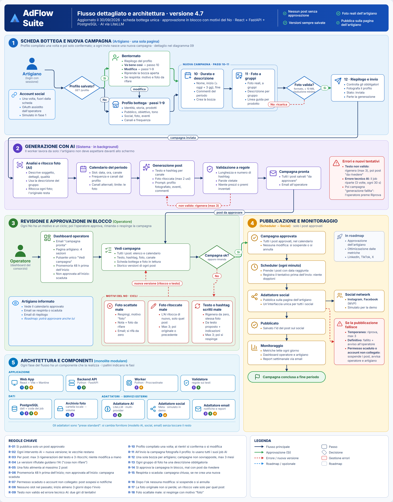
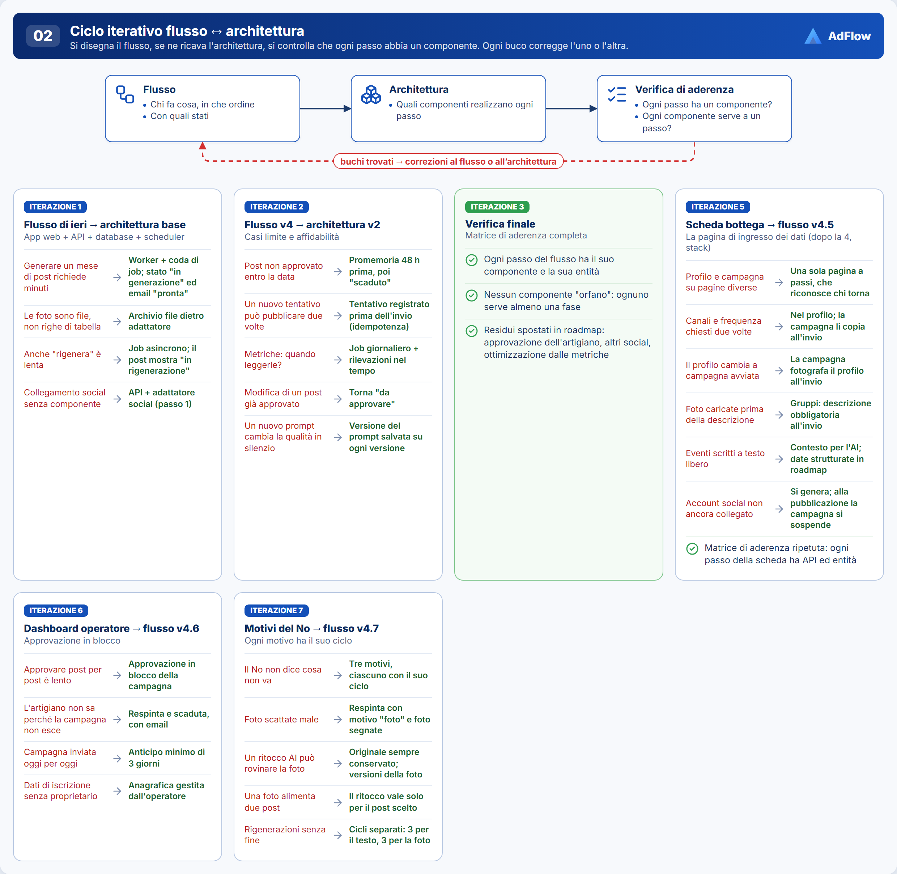
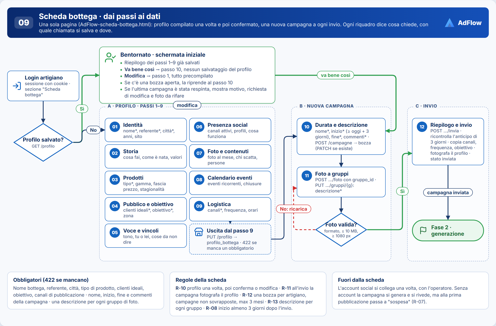
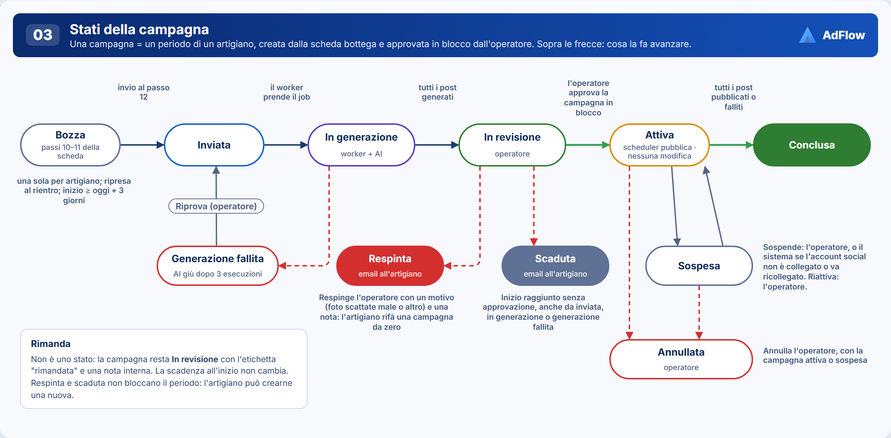
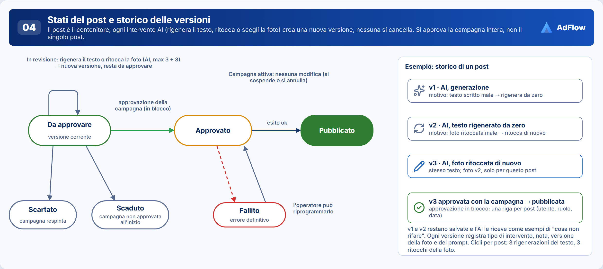
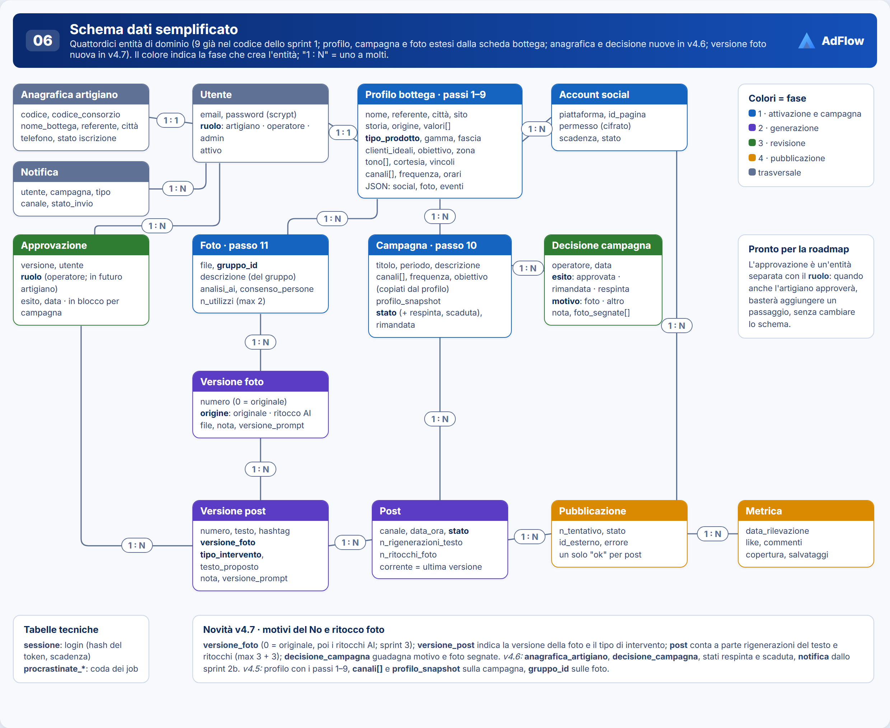
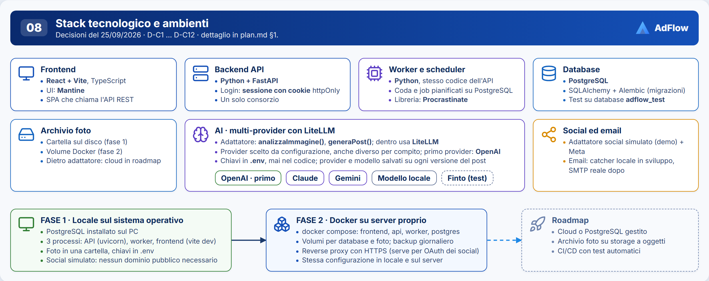

# AdFlow Suite · Flusso aggiornato e architettura software (v4.7)

**Data:** 30/09/2026 · **Stato:** v4.7 del 30/09/2026 (v4.6 del 28/09/2026) · **Ruolo:** B3 · Architetto software

> I diagrammi sono nella cartella `diagrammi/` (PNG) e tutti insieme in `AdFlow-diagrammi.html`. Da lì ogni diagramma si scarica in PNG, oppure si stampa in PDF. Lo schema statico della pagina di raccolta dati (non interattivo, da usare come base per lo sviluppo) è in `AdFlow-scheda-bottega.html`; il diagramma 09 lo collega ad API e dati. La pagina dell'operatore dedicata a un artigiano è in `AdFlow-operatore-artigiano.html` (schema statico). Per rigenerare i PNG dopo una modifica ai diagrammi: `strumenti/LEGGIMI.md`.

**Novità v4.7:** **motivi del No** nella revisione, ciascuno con il suo ciclo: foto scattate male → campagna **respinta con motivo "foto"** e foto segnate; foto ritoccate male dall'AI → **ritocca di nuovo** (solo per quel post); testo o hashtag scritti male → **rigenera da zero** o **da un testo proposto** con indicazioni, tenendo la foto. Nuovo passo di **ritocco AI delle foto** in generazione (originale sempre conservato, `versione_foto`). **Cicli separati** per post: 3 rigenerazioni del testo e 3 ritocchi della foto. **Niente modifica a mano** dei post e **nessuna modifica in campagna attiva**. Decisioni D-30…D-34 (D-06, D-21 e D-26 sostituite, D-02 aggiornata), regole R-02, R-03, R-16 aggiornate, R-17 e R-18 nuove; aggiornati §0, §2, Fase 2 e Fase 3 (§3), §5, §6, §8, §10, §12. Diagrammi aggiornati: 01, 02 (iterazioni 6 e 7), 03, 04, 05, 06, 09; pagine statiche operatore e scheda bottega. ADR-40…ADR-44. Il tipo di ritocco e i prompt AI si decidono in un task dedicato.

**Novità v4.6:** **approvazione in blocco** della campagna da parte dell'operatore (approva / rimanda / respingi), sul singolo post solo rigenera e modifica; campagna **respinta** (email all'artigiano, si riparte da zero) e **scaduta** (non approvata entro l'inizio); anticipo minimo di 3 giorni tra invio e inizio; **anagrafica artigiano** gestita dall'operatore; **dashboard operatore** in quattro pagine con pulsante unico "Vedi campagna" (schema statico `AdFlow-operatore-artigiano.html`). Decisioni D-20…D-29 (D-03 e D-05 sostituite), regole R-06 e R-08 aggiornate, R-14…R-16 nuove; riscritte Fase 3 e dashboard artigiano (§3), stati (§4), schema dati (§6), matrice (§8), sprint (§12). Diagrammi aggiornati: 01, 03, 04, 06, 09. ADR-30…ADR-39.

**Novità v4.5:** la pagina di ingresso dei dati è la **scheda bottega** (`AdFlow-scheda-bottega.html`, schema statico da usare nello sviluppo): profilo e nuova campagna in un solo percorso a 12 passi, con schermata "Bentornato" ai rientri. Riscritta la Fase 1 (§3, con dettaglio passo per passo), decisioni D-08…D-19, regole R-10…R-13, schema dati (§6), matrice (§8) e piano sprint (§12). Diagrammi aggiornati: 01, 02, 03, 05, 06; nuovo **09 · Scheda bottega**. ADR-15…ADR-29.

**Novità v4.4:** dettaglio della dashboard artigiano (nuova sezione dopo §3 Fase 3): cosa vede per ogni stato della campagna, regola di visibilità dei post, punto aperto su post scartati/scaduti non segnalati. Aggiunta voce corrispondente in §10.

**Novità v4.3:** sprint 1 completato e repository avviato (§12). Decisioni D-C9…D-C12 (coda, UI, monorepo, test), regola R-08, schema dati allineato al codice. Aggiornati i diagrammi 01, 05, 06, 08.

**v4.2:** login con sessione e cookie (D-C5), AI tramite LiteLLM (D-C6), primo provider OpenAI (D-C7), un solo consorzio (D-C8). Aggiornati §1, §5, §10, §11 e i diagrammi 01, 05, 08.

**v4.1:** stack tecnologico deciso (D-C1…D-C4), nuovo §11 e nuovo diagramma 08.

---

## 0. Sintesi

- L'artigiano entra con il login nella **scheda bottega**: la prima volta compila il profilo (passi 1–9), ai rientri lo conferma o lo modifica. Nella stessa pagina crea la campagna del periodo (passi 10–11: durata, commenti, **foto reali** a gruppi, ciascuno con la sua descrizione) e la invia (passo 12). Il **proprio** account social si collega una volta, con l'operatore.
- Un **worker** (programma in background) analizza le foto con l'AI, le **ritocca** (l'originale resta sempre) e genera **tutti i post del periodo**. Una validazione a regole controlla i testi.
- **L'operatore del consorzio** rivede la campagna nella pagina **Vedi campagna**. Se un post non va, sceglie il motivo e chiede all'AI di **ritoccare di nuovo la foto** o di **rigenerare il testo** (da zero o da un testo proposto), sempre con un numero massimo di cicli; niente modifica a mano (le versioni precedenti restano salvate). Poi decide **sulla campagna intera**: **approva** tutti i post, **rimanda** la decisione o **respinge** la campagna con un motivo (per esempio foto scattate male) inviato per email all'artigiano. Se nessuno approva entro l'inizio, la campagna **scade**.
- Lo **scheduler** pubblica **solo i post approvati**, nelle date stabilite, sulla **pagina dell'artigiano**. Poi raccoglie le metriche.
- **Architettura:** monolite modulare più worker, con PostgreSQL (dati e coda dei job), archivio foto e tre adattatori (AI, social, email).
- **Stack:** React + Vite (TypeScript) · Python + FastAPI · PostgreSQL · AI multi-provider tramite LiteLLM (primo provider: OpenAI) · login con sessione e cookie · un solo consorzio. Fase 1 in locale sul sistema operativo, fase 2 in Docker su server proprio.



---

## 1. Registro decisioni

| ID | Decisione | Motivazione | Alternative scartate |
|---|---|---|---|
| D-01 | Il form acquisisce il **tipo di prodotto** (da elenco) | Guida testi, hashtag, linea guida foto e vincoli | Campo libero |
| D-02 | **Foto reali** con descrizione e richieste; analisi AI della foto · *aggiornata v4.7:* l'AI ritocca le foto reali, non le genera (D-31) | Contenuti veri e specifici | Immagini generate dall'AI |
| D-03 | Si ricevono **tutti i post del periodo**: accetta o rigenera; **le versioni precedenti restano** · **Sostituita da D-20 (v4.6)** | Nessun post esce senza essere visto | Approvare solo il piano; 3 piani alternativi |
| D-04 | Lo **scheduler pubblica** nelle date stabilite | Nessun intervento quotidiano | Pubblicazione manuale |
| D-05 | **L'operatore** accetta, rigenera o modifica · **Sostituita da D-20 e D-21 (v4.6)** | Un solo punto di controllo | Artigiano; doppia approvazione (roadmap) |
| D-06 | Ammessa la **modifica manuale** del testo · **Sostituita da D-32 (v4.7)** | Sblocca i casi che l'AI non centra | Solo rigenerazione |
| D-07 | Si pubblica sulla **pagina social dell'artigiano**; in futuro approverà anche lui | Il cliente segue l'artigiano | Pagina del consorzio |
| D-08 | Profilo bottega e nuova campagna sono **un'unica pagina** a passi, non due pagine separate | Un solo percorso da seguire, nessuna sincronizzazione tra pagine | Due pagine collegate da un link |
| D-09 | Al ritorno (già loggato), l'artigiano vede un **riepilogo con "va bene così" o "modifica"** prima della nuova campagna | Non deve rileggere/riscrivere tutto ogni volta, ma può aggiornarlo | Andare sempre al form vuoto; saltare sempre dritto alla campagna |
| D-10 | Le foto di una campagna si caricano **a gruppi**, una descrizione condivisa per gruppo; la foto si carica subito, la descrizione si scrive dopo ed è obbligatoria all'invio | Evita di ripetere la stessa descrizione su scatti dello stesso soggetto | Descrizione per singola foto (più lento per l'artigiano) |
| D-11 | Il **calendario eventi ricorrenti** della bottega è un campo lista dentro il profilo, non una tabella propria | Pochi eventi per bottega, non serve un'entità a parte per ora | Tabella `evento_bottega` dedicata (rimandata, vedi §10) |
| D-12 | **Canali, frequenza e obiettivo** si chiedono una volta nel profilo (passi 4 e 9); la campagna li **copia all'invio** | Nessuna domanda ripetuta a ogni campagna; il calendario di una campagna non cambia se poi cambia il profilo | Chiederli a ogni campagna, come prima della v4.5 |
| D-13 | All'invio la campagna **fotografa il profilo** (`profilo_snapshot`): generazione, Riprova e rigenerazioni usano quella | Tracciabilità, come la versione del prompt; l'operatore vede ciò che ha ricevuto l'AI | Leggere sempre il profilo corrente |
| D-14 | **Una bozza alla volta** per artigiano, creata al passo 10 e ripresa al rientro; campagne non sovrapposte; durata massima 3 mesi | Niente campagne orfane né post doppi nello stesso periodo; costi AI sotto controllo | Più bozze in parallelo |
| D-15 | L'**account social** si collega fuori dalla scheda, una volta, con l'operatore; l'invio è consentito anche senza | L'OAuth porta su Meta e in fase 2 richiede HTTPS: non può stare in mezzo ai passi | Passo obbligatorio dentro la scheda |
| D-16 | **Eventi e chiusure** entrano nel prompt come contesto, non generano slot in automatico | Nella scheda "quando" è testo libero ("6-8 dicembre", "ogni prima domenica"): niente date affidabili | Date strutturate subito (in roadmap, §7) |
| D-17 | **Controllo foto** al caricamento: formato, peso ≤ 10 MB, lato corto ≥ 1080 px; luce e nitidezza solo segnalate dall'analisi AI | Controlli oggettivi e immediati, nessun rifiuto sbagliato | Rifiuto automatico per qualità |
| D-18 | All'invio la **generazione parte da sola**: l'operatore non approva la scheda prima dell'AI | Un solo punto di controllo, sui post; nessun collo di bottiglia in più (rischio 2) | Operatore che approva la scheda prima della generazione |
| D-19 | **Frequenza** = post totali a settimana (1-2 → 2, 3-4 → 3, 5 o più → 5, "decidete voi" → 3); i canali scelti si alternano negli slot | Carico di revisione prevedibile; R-05 invariata | Un post per ogni canale in ogni slot (raddoppia la revisione) |
| D-20 | L'operatore **approva la campagna in blocco**: approva (tutti i post), rimanda, respinge (ADR-30) | Una decisione per campagna invece di una per post: meno lavoro per l'operatore (rischio 2), stato della campagna sempre chiaro | Approvazione post per post (D-03, D-05) |
| D-21 | In revisione, sul singolo post solo **rigenera** o **modifica a mano**; niente scarto del singolo post (ADR-31) · **Sostituita da D-32 (v4.7)** | I post si sistemano prima della decisione; un post che non va si corregge, non si toglie | Scartare il singolo post |
| D-22 | **Rimanda** = etichetta e nota interna, nessuno stato nuovo (ADR-32) | Serve solo a ricordare "decido dopo"; la scadenza resta la stessa | Stato "rimandata"; spostare il periodo della campagna |
| D-23 | **Respingi** = campagna chiusa (`respinta`), email all'artigiano con la richiesta di modifica; l'artigiano rifà una campagna da zero (ADR-33) | Storico e fotografia del profilo intatti, nessun "giro" di reinvio da gestire | Riaprire la stessa campagna; nuova bozza precompilata |
| D-24 | **Scaduta** = campagna non approvata entro l'inizio; tutti i post scaduti, email all'artigiano (ADR-34) | Regola netta: una campagna approvata non ha mai post nel passato | Scadenza post per post; scadenza a fine periodo |
| D-25 | **Anticipo minimo** di 3 giorni tra invio e inizio (ADR-35) | Tempo per generazione, eventuale Riprova e revisione prima della scadenza | Inizio anche oggi |
| D-26 | In campagna attiva l'operatore **modifica** un post non pubblicato e la modifica vale già come approvata; niente rigenerazione (ADR-36) · **Sostituita da D-34 (v4.7)** | L'approvatore è lui; nessun job AI in corso all'ora di pubblicare | Tornare "da approvare" |
| D-27 | **Storico decisioni** in `decisione_campagna`; notifiche ed email anticipate allo sprint 2b (ADR-37) | Tracciabilità di rinvii e respinte; la respinta deve arrivare all'artigiano | Solo lo stato della campagna |
| D-28 | **Anagrafica artigiano** gestita dall'operatore, distinta dal profilo bottega (ADR-38) | Dati ufficiali di iscrizione stabili; il profilo resta dell'artigiano | Tutto nel profilo, modificabile dall'artigiano |
| D-29 | **Dashboard operatore** in quattro pagine; pagina artigiano con quattro sezioni e pulsante unico **Vedi campagna** (ADR-39) | Un solo punto di ingresso per ogni campagna, con tutti i post e il calendario | Azioni diverse per ogni sezione |
| D-30 | **Respingi con motivo**: `foto` (con le foto da rifare segnate) o `altro`; motivo, nota e foto segnate vanno all'artigiano (ADR-40) | Foto scattate male non si salvano con l'AI: l'artigiano deve sapere cosa rifotografare | Nota libera senza motivo; cancellare la campagna (perde lo storico, ADR-12) |
| D-31 | **Ritocco AI delle foto** in generazione; originale sempre conservato; versioni della foto (ADR-41) | Le foto da smartphone migliorano molto con un ritocco; con l'originale si può sempre tornare indietro | Solo analisi; ritocco solo su richiesta dell'operatore |
| D-32 | Sul singolo post solo **tre interventi AI**: ritocca di nuovo la foto, rigenera il testo da zero, rigenera da un testo proposto con indicazioni; **niente modifica a mano** (ADR-42) | Ogni testo passa dall'AI e dalla validazione; il motivo del No resta tracciato nella versione | Modifica a mano (D-06, D-21) |
| D-33 | **Cicli separati** per post: 3 rigenerazioni del testo e 3 ritocchi della foto; finiti i ritocchi si sceglie l'originale o una versione precedente, finite le rigenerazioni si respinge (ADR-43) | Costi AI sotto controllo; un problema di foto non consuma i tentativi sul testo | Contatore unico; limite per campagna |
| D-34 | **Nessuna modifica in campagna attiva**: si sospende o si annulla (ADR-44) | Esce esattamente ciò che è stato approvato; nessun job AI vicino all'ora di pubblicazione | Modifica a mano già approvata (D-26) |
| D-A | **Monolite modulare + worker** | Semplice da spiegare e costruire | Microservizi, serverless |
| D-B | **Coda dei job in PostgreSQL** | Nessun servizio in più | Redis, cron |
| D-C1 | Backend e worker in **Python + FastAPI** | Ecosistema AI più ricco; un solo linguaggio lato server; documentazione API automatica | Node/TypeScript, Next.js |
| D-C2 | Frontend **React + Vite** (TypeScript) | Il più diffuso, molte librerie per calendario e form | Angular, Vue |
| D-C3 | **Fase 1:** locale sul sistema operativo. **Fase 2:** Docker su server proprio | Si parte senza infrastruttura; Docker quando il flusso funziona | Cloud gestito (Render, AWS) → roadmap |
| D-C4 | **AI multi-provider**: provider scelto da configurazione | Nessun vincolo a un fornitore; confronto qualità/costo; riserva se un provider è giù | Un solo provider fisso |
| D-C5 | Login con **sessione e cookie** httpOnly | Più semplice e sicuro per una SPA sullo stesso dominio; logout immediato | Token JWT, provider esterno |
| D-C6 | Multi-provider tramite **LiteLLM** (dentro l'adattatore AI) | Molti provider con la stessa sintassi, meno codice da scrivere | Interfaccia propria + SDK ufficiali |
| D-C7 | Primo provider reale: **OpenAI** | Testo + visione, documentazione ampia | Claude, Gemini, modello locale |
| D-C8 | **Un solo consorzio** | Schema e permessi più semplici | Multi-tenant (più consorzi) |
| D-C9 | Coda e job pianificati con **Procrastinate** | Libreria pronta su PostgreSQL: nuovi tentativi, job ogni minuto, lock | Tabella scritta da noi |
| D-C10 | Interfaccia con **Mantine** | Componenti pronti per form, card, notifiche | MUI, Tailwind + shadcn/ui |
| D-C11 | **Monorepo**: `backend/`, `frontend/`, `docs/` | Una modifica, un commit; più semplice per 5 persone | Due repository |
| D-C12 | Test **unitari + API** su PostgreSQL reale; **un solo end-to-end** finale | Sicurezza veloce; l'E2E solo per dimostrare l'insieme | Anche E2E per ogni funzione |

---

## 2. Metodo: ciclo iterativo flusso ↔ architettura

Il metodo ha tre passi: si disegna il flusso, se ne ricava l'architettura, si verifica che **ogni passo abbia un componente** e che **ogni componente serva a un passo**. Ogni buco trovato corregge il flusso o l'architettura.



| Iterazione | Buco trovato | Correzione |
|---|---|---|
| 1 | Generare un mese di post richiede minuti | Worker + coda di job; stato "in generazione" ed email "campagna pronta" |
| 1 | Le foto sono file, non righe di tabella | Archivio file dietro adattatore |
| 1 | Anche "rigenera" è lenta | Job asincrono; il post mostra "in rigenerazione" |
| 1 | Il collegamento dell'account social non ha un componente | API + adattatore social |
| 2 | Post non approvato entro la data | Promemoria 48 h prima, poi "scaduto" |
| 2 | Un nuovo tentativo può pubblicare due volte | Tentativo registrato prima dell'invio (**idempotenza**) |
| 2 | Metriche: quando leggerle? | Job giornaliero + rilevazioni nel tempo |
| 2 | Modifica di un post già approvato | Torna "da approvare" (in v4.6: vale già come approvata, D-26; in v4.7: nessuna modifica in campagna attiva, D-34) |
| 2 | Un nuovo prompt cambia la qualità senza che nessuno lo sappia | Versione del prompt salvata su ogni versione |
| 3 | Verifica finale | Matrice completa (§8); i residui vanno in roadmap |
| 4 *(stack)* | Con più provider AI, qualità e costi cambiano senza traccia | **Provider e modello** salvati su ogni versione del post |
| 4 *(stack)* | In fase 1 non c'è un dominio pubblico per l'OAuth dei social | Fase 1 con social **simulato**; OAuth reale in fase 2 con HTTPS |
| 5 *(scheda bottega)* | Profilo e campagna su pagine diverse | Una sola pagina a passi, che riconosce chi torna (D-08, D-09) |
| 5 *(scheda bottega)* | Canali e frequenza chiesti a ogni campagna | Nel profilo; la campagna li copia all'invio (D-12) |
| 5 *(scheda bottega)* | Il profilo cambia mentre una campagna è in corso | Fotografia del profilo sulla campagna (D-13) |
| 5 *(scheda bottega)* | Le foto si caricano prima di scriverne la descrizione | Descrizione di gruppo, obbligatoria all'invio (D-10) |
| 5 *(scheda bottega)* | Il "quando" degli eventi è testo libero | Contesto per l'AI; date strutturate in roadmap (D-16) |
| 5 *(scheda bottega)* | Account social non ancora collegato all'invio | Si genera e si rivede; alla prima pubblicazione la campagna si sospende (D-15, R-07) |
| 5 *(scheda bottega)* | Verifica | Matrice (§8) ripetuta: ogni passo della scheda ha API ed entità |
| 6 *(dashboard operatore)* | Approvare post per post è lento e lascia la campagna in uno stato poco chiaro | Approvazione in blocco della campagna (D-20) |
| 6 *(dashboard operatore)* | L'artigiano non sa perché una campagna non esce | Respinta con email e richiesta di modifica; scaduta con email (D-23, D-24) |
| 6 *(dashboard operatore)* | Una campagna inviata oggi per oggi non si può rivedere in tempo | Anticipo minimo di 3 giorni (D-25) |
| 6 *(dashboard operatore)* | Dati di iscrizione dell'artigiano senza un proprietario | Anagrafica gestita dall'operatore (D-28) |
| 7 *(motivi del No)* | Il No dell'operatore non dice cosa non va, né cosa fare | Tre motivi, ciascuno con il suo ciclo (D-30, D-32) |
| 7 *(motivi del No)* | Le foto scattate male non si sistemano con l'AI | Respinta con motivo "foto" e foto segnate (D-30) |
| 7 *(motivi del No)* | Un ritocco AI sbagliato può rovinare la foto | Originale sempre conservato, versioni della foto (D-31) |
| 7 *(motivi del No)* | Una foto alimenta due post: un nuovo ritocco li cambia entrambi | Il ritocco vale solo per il post scelto (D-32) |
| 7 *(motivi del No)* | Rigenerazioni senza fine | Cicli separati per testo e foto, massimo 3 (D-33) |

---

## 3. Flusso dettagliato (v4)

### Fase 1 · Scheda bottega e nuova campagna (artigiano)



| # | Passo | Dettaglio |
|---|---|---|
| 1.0 | Accesso | Login con sessione (D-C5), sezione "Scheda bottega per generazione campagna". `GET /profilo`: se il profilo esiste → 1.1b, altrimenti → 1.1 |
| 1.1 | Profilo bottega · passi 1–9 *(una volta)* | Identità, storia, prodotti (**tipo di prodotto** da elenco), pubblico e obiettivo, voce e vincoli, presenza social attuale, politica foto, calendario eventi, logistica (canali, frequenza, orari). Lasciando il passo 9: `PUT /profilo` |
| 1.1b | Bentornato *(ai rientri)* | Riepilogo del profilo: **Va bene così** → 1.3, senza salvare nulla; **Modifica** → 1.1 già compilato. Se c'è una bozza aperta la riprende (D-14). Se l'ultima campagna è stata respinta, mostra la richiesta di modifica dell'operatore (D-23) |
| 1.2 | Collega account social *(una volta, fuori dalla scheda)* | OAuth sulla **pagina dell'artigiano**, con l'operatore; simulato in fase 1. Non blocca l'invio (D-15) |
| 1.3 | Nuova campagna · passo 10 | Nome, inizio (almeno 3 giorni dopo oggi, R-08, D-25), fine (massimo 3 mesi, periodo non sovrapposto), commenti del periodo. `POST /campagne` → bozza, oppure `PATCH` se la bozza c'è già |
| 1.4 | Foto a gruppi · passo 11 | Foto reali caricate subito con il loro `gruppo_id`; una descrizione per gruppo (`PUT …/gruppi/{g}`); linea guida per tipo di prodotto (Appendice A) |
| 1.5 | Controllo tecnico foto | Al caricamento: JPG/PNG/WEBP, ≤ 10 MB, lato corto ≥ 1080 px; se no si ricarica. Luce e nitidezza: segnalate dall'analisi AI, non bloccanti (D-17) |
| 1.6 | Riepilogo e invio · passo 12 | Controlla gli obbligatori. `POST /campagne/{id}/invia`: copia canali, frequenza e obiettivo dal profilo, salva `profilo_snapshot`, bozza → inviata, parte `genera_campagna` (D-12, D-13, D-18) |

#### Dettaglio 1.0–1.6 · Pagina "scheda bottega" (profilo + nuova campagna)

Profilo e campagna non sono due pagine distinte: è **un unico percorso a passi** (schema statico: `AdFlow-scheda-bottega.html`; diagramma 09), diviso in tre parti (D-08).

| Parte | Passi | Contenuto | Si salva |
|---|---|---|---|
| A · Profilo bottega | 1-9 | Identità, storia, prodotti, pubblico e obiettivo, voce e vincoli, presenza social attuale, politica foto, calendario eventi ricorrenti, logistica di pubblicazione | Lasciando il passo 9 (`PUT /profilo`) |
| B · Nuova campagna | 10-11 | Nome campagna, durata (inizio/fine), commenti del periodo, foto caricate a gruppi con una descrizione per gruppo | Lasciando il passo 10 (bozza); ogni foto appena caricata; la descrizione del gruppo mentre si scrive |
| C · Riepilogo | 12 | Rilettura di tutto, evidenzia i campi obbligatori mancanti, un solo invio all'operatore | Nulla di nuovo: controlla e invia |

**Al primo accesso** (nessun profilo salvato) l'artigiano parte dal passo 1. **Ai rientri** (D-09), da loggato, la pagina precarica il profilo e mostra subito la schermata "Bentornato" con il riepilogo della parte A e due scelte: **"Va bene così"** (salta al passo 10) o **"Voglio modificare qualcosa"** (rientra dal passo 1, tutto già compilato). Il profilo è **uno solo per bottega** e si aggiorna sul posto; ogni invio della parte B crea una **nuova campagna**. Poiché ogni parte si salva quando la si lascia, un'interruzione non fa perdere nulla: al rientro la bozza riparte dal passo 10.

**Anticipo minimo (D-25).** L'inizio deve cadere almeno 3 giorni dopo oggi: il controllo si ripete all'invio, perché una bozza lasciata ferma può non rispettarlo più. Serve a lasciare all'operatore il tempo di approvare prima dell'inizio (D-24).

**Obbligatori.** Profilo: nome bottega, referente, città, tipo di prodotto, clienti ideali, obiettivo, canali di pubblicazione. Campagna: nome, inizio, fine, commenti. Foto: almeno un gruppo, ciascuno con la sua descrizione (R-13). Gli stessi controlli stanno nel frontend (evidenziati nel riepilogo) e nel backend (422).

**Dalla scheda alla generazione.** Canali, frequenza e obiettivo non si chiedono più a ogni campagna: stanno nel profilo e la campagna li copia all'invio (D-12). Nello stesso momento la campagna salva una fotografia del profilo (`profilo_snapshot`, D-13): generazione, Riprova e rigenerazioni usano quella, quindi una modifica al profilo vale dalla campagna successiva e l'operatore vede esattamente ciò che ha ricevuto l'AI. Eventi ricorrenti, chiusure e commenti del periodo entrano nel prompt come contesto (D-16). Il numero di post è il minore tra frequenza × settimane e foto disponibili × usi massimi (R-05); i canali scelti si alternano (D-19).

**Account social.** Resta un'azione separata, una volta sola, fatta con l'operatore (D-15). Se all'invio l'account non è ancora collegato, la campagna si genera e si rivede normalmente; alla prima pubblicazione passa a "sospesa" e partono le notifiche (R-07), come per un permesso scaduto.

**Punto da verificare:** i campi raccolti in parte A sono più numerosi di quelli minimi dello sprint 1 (schema aggiornato in §6); da confermare con l'operatore quali sono davvero indispensabili prima di costruire la UI definitiva, per non appesantire l'intervista.

### Fase 2 · Generazione con AI (sistema, in background)
| # | Passo | Dettaglio |
|---|---|---|
| 2.1 | Analisi foto | Modello AI con visione (provider da configurazione); usa la descrizione del gruppo; annota eventuali problemi di luce o nitidezza per l'operatore |
| 2.1b | Ritocco foto *(sprint 3)* | L'AI ritocca ogni foto (versione 1); l'originale resta come versione 0 (D-31). Tipo di ritocco e prompt: task dedicato |
| 2.2 | Calendario del periodo | Slot data, ora e canale in base a frequenza e canali copiati dal profilo (canali alternati, D-19) e al numero di foto; orari preferiti del profilo come indicazione |
| 2.3 | Generazione post | Testo e hashtag per canale, foto ritoccata abbinata (max 2 usi), prompt per tipo di prodotto con la fotografia del profilo, eventi e chiusure del periodo e commenti della campagna |
| 2.4 | Validazione a regole | Lunghezza, numero di hashtag, parole vietate (comprese le "cose da non dire" del profilo, passo 05), niente prezzi o premi inventati. Se non valido si rigenera (max 3), poi "da rivedere" |
| 2.5 | Campagna pronta | Post salvati "da approvare", campagna "in revisione"; email all'operatore (sprint 3) |
| 2.6 | Errore tecnico dell'AI | Il job riparte da solo (3 esecuzioni in tutto, ogni 30 s). Se fallisce anche la 3ª: campagna "generazione fallita", visibile in dashboard (email dallo sprint 3); l'operatore preme **Riprova** |

### Fase 3 · Revisione e approvazione in blocco (operatore)
| # | Passo | Dettaglio |
|---|---|---|
| 3.1 | Dashboard operatore | Pagina artigiano con le campagne in quattro sezioni (da approvare, in corso, scadute, passate) e un solo pulsante **Vedi campagna** (D-29); promemoria 48 h prima dell'inizio (sprint 3) |
| 3.2 | Vedi campagna | Tutti i post della campagna in ogni stato, in elenco e in calendario: testo, hashtag, foto, canale, storico versioni; scheda bottega (fotografia del profilo) e foto con descrizioni in sola lettura |
| 3.3 | Sistemare i post | Sul singolo post, secondo il motivo: **Ritocca di nuovo la foto** (max 3), **Rigenera il testo da zero** o **Rigenera da un testo proposto** con indicazioni (max 3 insieme), tenendo la foto. Ogni intervento crea una nuova versione che ripassa la validazione; il post resta "da approvare". Niente modifica a mano (D-32, D-33) |
| 3.4 | Decisione sulla campagna | **Approva**: tutti i post approvati, campagna attiva (non se un post è "da rivedere" o ha un intervento in corso). **Rimanda**: etichetta e nota interna, nessun cambio di stato. **Respingi**: motivo (`foto` o `altro`) e nota obbligatori, con `foto` anche le foto da rifare; campagna respinta, email all'artigiano (D-20, D-22, D-23, D-30) |
| 3.5 | Scadenza | Nessuna approvazione entro le 00:00 del giorno di inizio: campagna **scaduta**, tutti i post scaduti, email all'artigiano (D-24) |
| 3.6 | Dopo l'approvazione | In campagna attiva nessuna modifica ai post (D-34). Se un post non va più bene: sospendi o annulla dalla stessa pagina; riattiva dopo una sospensione |
| 3.7 | Artigiano informato | Calendario approvato in sola lettura + email di riepilogo (sprint 3); email per respinta e scadenza (sprint 2b) |

#### Dettaglio 3.3–3.4 · Motivi del No e cicli

Quando la campagna non va bene (ramo **No** del rombo "Campagna ok?"), l'operatore sceglie il motivo; ogni motivo ha il suo ciclo.

| Motivo | Dove agisce | Ciclo | Limite | Quando i cicli finiscono |
|---|---|---|---|---|
| **Foto scattate male** (buie, mosse, soggetto sbagliato) | Campagna intera | **Respingi** con motivo `foto`: nota obbligatoria e foto da rifare segnate; email all'artigiano con le miniature; la campagna resta `respinta` nello storico e l'artigiano ne crea una nuova con foto nuove | — | — |
| **Foto ritoccate male dall'AI** | Singolo post *(sprint 3)* | **Ritocca di nuovo**, con nota facoltativa: nuova versione della foto, **solo per quel post** anche se la foto alimenta un altro post | 3 ritocchi per post | Si sceglie la foto originale o una versione precedente (non consuma cicli) |
| **Testo o hashtag coerenti ma scritti male** | Singolo post | ① **Rigenera da zero**, tenendo la foto · ② **Rigenera da un testo proposto** dall'operatore più indicazioni, tenendo la foto | 3 rigenerazioni per post (① e ② insieme) | Resta solo **Respingi** con motivo `altro` |
| Altro | Campagna intera | **Respingi** con motivo `altro` e nota | — | — |

Ogni intervento crea una nuova versione del post (tipo di intervento, nota e testo proposto salvati), che ripassa la validazione; le versioni rifiutate diventano esempi di "cosa non rifare" (R-04). Il post "da rivedere" si sblocca solo con un nuovo intervento. Quando tutti i post vanno bene, l'operatore **approva** in blocco.

#### Dettaglio 3.1 · Dashboard operatore

Quattro pagine (D-29): **elenco artigiani**, **pagina artigiano**, **Vedi campagna**, **metriche**. Schema statico della pagina artigiano: `AdFlow-operatore-artigiano.html`.

| Parte della pagina artigiano | Contenuto | Chi la scrive |
|---|---|---|
| Anagrafica | Codice artigiano, codice consorzio, nome bottega, referente, città, email di accesso, telefono, iscrizione | Solo l'operatore (D-28); in futuro importata dal sito del consorzio (da decidere) |
| Account social | Stato del collegamento per canale, con "Collega" / "Ricollega" (sprint 3) | Operatore, insieme all'artigiano (D-15) |
| Situazione | Bozza aperta dell'artigiano (solo informativa), data dell'ultima modifica del profilo, conteggi dei post, link alle metriche | Sistema |
| Campagne | Quattro sezioni, ogni campagna con periodo, canali, foto, post per stato, prossima scadenza e il pulsante **Vedi campagna** | Sistema |
| Profilo bottega | Passi 1–9 in sola lettura (profilo di oggi; ogni campagna usa la sua fotografia) | Artigiano |

| Sezione | Stati della campagna |
|---|---|
| Da approvare | `inviata`, `in_generazione`, `generazione_fallita` (con "Riprova"), `in_revisione` (anche con l'etichetta "rimandata") |
| In corso | `attiva`, `sospesa` |
| Scadute | `scaduta`: richieste inviate dall'artigiano e non approvate in tempo |
| Passate | `conclusa`, `annullata`, `respinta` |

Nella pagina **Vedi campagna** si trovano tutti i post nello stato da approvare, approvato, pubblicato, fallito o scaduto (scartato solo per le campagne respinte), il calendario del periodo, le decisioni sulla campagna e le azioni sui post. Il nome, il referente e la città stanno sia nell'anagrafica (dato ufficiale) sia nel passo 1 del profilo: se sono diversi, la pagina lo segnala.

#### Dettaglio 3.7 · Dashboard artigiano

L'artigiano non ha una vista "in sola lettura di tutto": la dashboard è filtrata per stato, e mostra sempre solo l'esito del lavoro dell'operatore, mai il lavoro in corso. Sull'elenco delle sue campagne vede sempre titolo, periodo, canale, stato, numero di foto e numero di post; aprendo una campagna vede il dettaglio che segue.

| Stato campagna | Cosa vede l'artigiano | Cosa può fare |
|---|---|---|
| `bozza` | La scheda riparte dal passo 10 con dati e foto già salvati | Modifica periodo e commenti, aggiunge o toglie foto, completa le descrizioni, invia (passo 12) |
| `inviata` / `in_generazione` | Etichetta di stato, messaggio "Generazione dei post in corso…" (la pagina si aggiorna da sola) | Nessuna: solo attesa |
| `generazione_fallita` | Avviso che la generazione non è riuscita per un problema tecnico | Nessuna: solo il consorzio (operatore) può rilanciarla con "Riprova" (ADR-14) |
| `in_revisione` | Ancora **nessun post**: i post restano visibili solo all'operatore finché la campagna non è approvata (anche se rimandata) | Nessuna: solo attesa |
| `respinta` | Il **motivo** e la **richiesta di modifica** dell'operatore, con le foto da rifare se il motivo è "foto" (arriva anche per email e nel Bentornato) | Crea una nuova campagna, da zero (D-23, D-30) |
| `scaduta` | Messaggio "La campagna non è stata approvata in tempo" (arriva anche per email) | Crea una nuova campagna |
| `attiva` | Calendario/lista dei post nello stato **approvato**, **pubblicato** o **fallito** | Nessuna: sola consultazione |
| `conclusa` | Come sopra, storico completo del periodo | Nessuna |

**Regola di visibilità (dal contratto API, SPEC-CODICE §5):** `GET /campagne/{id}` mostra all'artigiano solo i post `approvato`, `pubblicato` o `fallito`. I post `da_approvare`, `scartato` e `scaduto` non compaiono: l'artigiano vede l'esito finale del lavoro dell'operatore, non il suo svolgimento.

**Punto risolto in v4.6:** con l'approvazione in blocco non esistono più post scartati o scaduti dentro una campagna approvata. I due casi riguardano la campagna intera (respinta o scaduta) e l'artigiano ne è informato in dashboard e per email (D-23, D-24).

**Notifiche collegate:** email per campagna respinta e scaduta (sprint 2b, D-27); email di riepilogo quando la campagna passa in `attiva`, con l'elenco dei post approvati e la data di pubblicazione di ciascuno (sprint 3). Il promemoria 48 h (R-06) non è rivolto all'artigiano ma all'operatore, che deve ancora approvare.

**Metriche (sprint 4, non ancora disegnate):** la dashboard artigiano mostrerà le metriche simulate per ogni post pubblicato (like, commenti, copertura, salvataggi — entità Metrica, §6). Il layout di questa parte è ancora da disegnare.

### Fase 4 · Pubblicazione e monitoraggio (scheduler)
| # | Passo | Dettaglio |
|---|---|---|
| 4.1 | Scheduler (ogni minuto) | Prende i post approvati con data raggiunta |
| 4.2 | Registra il tentativo | Prima di chiamare il social: evita doppioni |
| 4.3 | Pubblica | Adattatore social → pagina dell'artigiano |
| 4.4 | Esito | OK: salva l'id del post. Errore temporaneo: riprova (max 3). Definitivo: "fallito" + avviso. Permesso scaduto o account mai collegato: sospende i post, avvisa operatore e artigiano |
| 4.5 | Monitoraggio | Metriche lette ogni giorno, dashboard, report settimanale |


### Regole di processo
| ID | Regola |
|---|---|
| R-01 | Si pubblica solo un post **approvato**. |
| R-02 | Ogni intervento (rigenera il testo, ritocca o scegli la foto) crea una **nuova versione**; le precedenti restano *(aggiornata v4.7)*. |
| R-03 | Per post, massimo **3 rigenerazioni del testo** e **3 ritocchi della foto**; niente modifica a mano *(aggiornata v4.7, D-33)*. |
| R-04 | Le versioni rifiutate vengono passate all'AI come esempi di "cosa non rifare". |
| R-05 | Una foto alimenta **al massimo 2 post**; se le foto non bastano, si propongono meno post. |
| R-06 | Promemoria all'operatore **48 ore prima dell'inizio** della campagna; se all'inizio la campagna non è approvata, è **scaduta** con tutti i suoi post *(aggiornata v4.6, D-24)*. |
| R-07 | Se il permesso dell'account scade, o l'account non è mai stato collegato, i post dell'artigiano vengono sospesi e partono le notifiche. |
| R-08 | Nessuno slot nel passato: una data già passata diventa **adesso + margine** (15 min, configurabile), così l'operatore ha il tempo di rivedere. Una campagna deve iniziare almeno **3 giorni dopo l'invio** *(aggiornata v4.6, D-25)*. |
| R-09 | Due giri di tentativi distinti: **testo non valido** → rigenera (max 3), poi il post si salva "da rivedere"; **errore tecnico AI** → il job riparte (3 esecuzioni), poi la campagna è "generazione fallita" e l'operatore la rilancia (ADR-14). |
| R-10 | Il profilo si compila **una volta**; ai rientri si conferma o si modifica, mai da zero. |
| R-11 | All'invio la campagna **fotografa il profilo**: tutti i suoi job AI usano quella fotografia; le modifiche al profilo valgono dalla campagna successiva. |
| R-12 | **Una sola bozza** per artigiano; le campagne dello stesso artigiano non si sovrappongono; durata massima 3 mesi. |
| R-13 | Ogni **gruppo di foto** ha una descrizione obbligatoria; senza, la campagna non si invia. |
| R-14 | L'operatore **approva la campagna in blocco**; non si approva se un post è "da rivedere" o in rigenerazione. |
| R-15 | Una campagna **respinta** o **scaduta** è chiusa: l'artigiano ne crea una nuova, e il periodo resta libero. |
| R-16 | Dopo l'approvazione **nessuna modifica** ai post: si sospende o si annulla *(aggiornata v4.7, D-34)*. |
| R-17 | La foto originale **non si perde mai**; un nuovo ritocco vale solo per il post su cui si lavora. |
| R-18 | Foto scattate male: la campagna si **respinge con motivo "foto"** e le foto da rifare segnate; l'AI non prova a salvarle. |

---

## 4. Stati





---

## 5. Architettura software


| Componente | Tecnologia | Cosa fa | Con chi parla | Se si rompe |
|---|---|---|---|---|
| **Web App** | React + Vite (TypeScript) | Viste per ruolo. Artigiano: pagina unica profilo bottega + nuova campagna (dettaglio in §3, "Dettaglio 1.1–1.6"), calendario in lettura, metriche (dettaglio in §3, "Dashboard artigiano"). Operatore: quattro pagine (elenco artigiani, pagina artigiano, Vedi campagna con decisioni in blocco, motivi del No e interventi AI sui post, calendario, metriche; D-29) | Backend API | Nessuna azione possibile, ma le pubblicazioni continuano |
| **Backend API** | Python + FastAPI, Pydantic; sessione con cookie | Moduli: autenticazione, utenti e ruoli, anagrafica artigiani, profili (lettura e salvataggio della scheda), campagne e bozze, foto a gruppi, post e versioni, decisioni sulla campagna (approva, rimanda, respingi), approvazioni, pubblicazioni, metriche, notifiche. All'invio copia canali/frequenza/obiettivo e fotografa il profilo. Mette i job in coda. Collega l'account social | DB, archivio, validatore, adattatore social | L'app si ferma; il worker continua |
| **Worker** | Python (stesso codice dell'API) | Job (quelli della campagna leggono `profilo_snapshot`): `analizza_foto`, `genera_campagna` (con il ritocco delle foto), `rigenera_post`, `ritocca_foto`, `pubblica_post` e scadenza delle campagne (ogni minuto), `invia_notifica`, `raccogli_metriche` (ogni giorno), `promemoria`, `report_settimanale` | DB, archivio, validatore, adattatori | I job restano in coda e ripartono: solo ritardo |
| **PostgreSQL** | PostgreSQL + SQLAlchemy/Alembic | Tutti i dati + coda dei job | API, worker | Tutto fermo: backup giornalieri |
| **Archivio foto** | Cartella locale → volume Docker | Originali, ritocchi AI e ritagli | API, worker | Generazione e pubblicazione ferme |
| **Validatore** | Modulo Python | Regole verificabili sui testi | API, worker | Post "da rivedere", mai pubblicato senza controllo |
| **Adattatore AI** | Nostra interfaccia + LiteLLM | `analizzaImmagine()`, `ritoccaImmagine()`, `generaPost()`; provider e modello da configurazione; prompt per tipo di prodotto, con versione | Provider AI | Nuovo tentativo, eventuale provider di riserva, poi "da rivedere" |
| **Adattatore social** | Interfaccia propria | `collegaAccount()`, `pubblica()`, `leggiMetriche()`; implementazioni Meta e **simulata** | Social | Nuovo tentativo, "fallito" o "account da ricollegare" |
| **Adattatore email** | SMTP | Notifiche e report | Catcher locale / SMTP reale | Notifica salvata e reinviata |

### D-A · Stile architetturale
| Opzione | Pro | Contro | Difficoltà per noi |
|---|---|---|---|
| **Monolite modulare + worker** ✔ | Semplice, un solo deploy | Scala meno oltre certe dimensioni | Bassa |
| Microservizi | Scalabilità indipendente | Complessità di rete, deploy, debug | Alta |
| Serverless | Niente server da gestire | Dipendenza dal fornitore, debug difficile | Media |

### D-B · Job e programmazione
| Opzione | Pro | Contro | Difficoltà |
|---|---|---|---|
| **Coda su PostgreSQL** ✔ | Nessun componente in più, retry inclusi | Meno adatta a volumi enormi | Bassa |
| Coda su Redis | Veloce, diffusa | Un servizio in più | Media |
| Cron + script | Il più semplice | Niente retry né stato | Bassa, ma rischiosa |

---

## 6. Schema dati



| Entità | Attributi chiave | Relazioni |
|---|---|---|
| **Utente** | email, password (scrypt), **ruolo** (artigiano / operatore / admin), attivo | 1:1 Anagrafica, Profilo; 1:N Sessione, Approvazione, Decisione, Notifica |
| **Anagrafica artigiano** | codice, codice_consorzio, nome_bottega, referente, città, telefono, stato_iscrizione, iscritto_il; scritta solo dall'operatore (D-28) | 1:1 Utente |
| **Profilo bottega** | *identità:* nome, referente, città, anni_attivita, sito · *storia:* storia, origine, valori[] · *prodotti:* **tipo_prodotto**, gamma, fascia_prezzo, stagionalita · *pubblico:* clienti_ideali, obiettivo, zona · *voce:* tono[], cortesia, vincoli · *logistica:* **canali[]**, frequenza, orari · JSON: social_esistenti, foto_policy, **eventi_ricorrenti** (D-11) · chiusure · aggiornato_il | 1:N Account social, Campagna, Foto |
| **Account social** | piattaforma, id_pagina, permesso (cifrato), scadenza, stato | 1:N Pubblicazione |
| **Campagna** | titolo, periodo, **descrizione**, **canali[]**, frequenza, obiettivo (copiati dal profilo all'invio, D-12), **profilo_snapshot** (D-13), **stato** (con `respinta` e `scaduta`, D-23, D-24), rimandata | 1:N Post, Decisione campagna |
| **Decisione campagna** | operatore, **esito** (approvata / rimandata / respinta), **motivo** (foto / altro), nota, foto segnate, data (D-27, D-30) | — |
| **Foto** | file, mime, **gruppo_id** (D-10), descrizione (del gruppo), richieste, analisi_ai, consenso_persone, n_utilizzi; legata a profilo e campagna | 1:N Versione foto |
| **Versione foto** | numero (0 = originale), file, **origine** (originale / ritocco AI), nota, provider e modello AI, versione_prompt (D-31) | 1:N Versione post |
| **Post** | canale, data_ora, **stato**, **n_rigenerazioni_testo**, **n_ritocchi_foto** (max 3 ciascuno, D-33). La versione corrente è **l'ultima** (niente campo dedicato) | 1:N Versione post, Pubblicazione |
| **Versione post** | numero, testo, hashtag, **versione della foto**, **tipo di intervento** (generazione / rigenera da zero / rigenera da proposta / ritocco foto / scelta foto), testo proposto, nota, versione_prompt, **provider_ai, modello_ai**, errori_validazione | 1:N Approvazione |
| **Approvazione** | versione, utente, **ruolo**, esito, data; scritta in blocco per ogni post all'approvazione della campagna (D-20) | pronta per l'approvazione dell'artigiano |
| **Pubblicazione** | n_tentativo, stato (in_corso / ok / errore), id_esterno, errore, data; **al massimo un "ok" per post** | 1:N Metrica |
| **Metrica** | data_rilevazione, like, commenti, copertura, salvataggi | — |
| **Notifica** | utente, campagna, tipo, canale, stato_invio; dallo sprint 2b per respinta e scadenza (D-27) | — |

**Tabelle tecniche:** `sessione` (login: hash del token, scadenza) e `procrastinate_*` (coda dei job, gestite dalla libreria).

**Nel codice oggi (sprint 1):** utente, sessione, profilo_bottega, campagna, foto, post, versione_post, approvazione, pubblicazione. Da aggiungere: decisione_campagna e notifica (sprint 2b), anagrafica_artigiano, account_social e versione_foto (sprint 3), metrica (sprint 4).

**Migrazione della scheda bottega (sprint 2a):** nessuna tabella nuova. Colonne nuove su `profilo_bottega` (campi dei passi 1–9; `tono` da testo a lista), `campagna` (`descrizione`, `canali[]` al posto di `canale`, `frequenza`, `obiettivo`, `profilo_snapshot`) e `foto` (`gruppo_id`, dimensioni in pixel). Le campagne dello sprint 1 migrano con `canali = [canale]` e senza snapshot.

**Migrazione della revisione in blocco (sprint 2b):** tabelle nuove `decisione_campagna` (con `motivo` e `foto_segnate`) e `notifica`; `campagna.rimandata` e i valori di stato `respinta`, `scaduta`; `post.n_rigenerazioni` diventa `n_rigenerazioni_testo`; `versione_post` guadagna `tipo_intervento`, `testo_proposto`, `nota`. Spariscono le API di approvazione e scarto del singolo post dello sprint 1 e la modifica a mano (`PUT /post/{id}`).

**Migrazione del ritocco foto (sprint 3):** tabella nuova `versione_foto`, con una versione 0 per ogni foto già caricata; `versione_post.versione_foto_id` e `post.n_ritocchi_foto`.

---

## 7. MVP, demo e roadmap

| MVP | Demo del pitch | Roadmap |
|---|---|---|
| Flusso 1–4 completo con Instagram e Facebook | Fasi 1→3 reali con un vero modello AI, **in locale**; pubblicazione con **adattatore simulato**; metriche finte ma realistiche; cambio di provider AI dal file di configurazione | Approvazione dell'artigiano, import dell'anagrafica e accesso dal sito del consorzio, riuso delle foto di una campagna respinta, date strutturate per gli eventi della scheda (calendario che li anticipa da solo), LinkedIn/TikTok/X, ottimizzazione dalle metriche, più consorzi, calendario drag & drop, app mobile, cloud |

---

## 8. Matrice di aderenza flusso → architettura

| Passo | Componenti | Entità | ✓ |
|---|---|---|---|
| 1.0 Accesso e riconoscimento | Web App, API (sessione, `GET /profilo`) | Utente, Profilo | ✓ |
| 1.1–1.1b Profilo e Bentornato | Web App, API (`PUT /profilo`) | Profilo | ✓ |
| 1.2 Collegamento social | API, Adattatore social | Account social | ✓ |
| 1.3 Nuova campagna in bozza | Web App, API (`POST`/`PATCH /campagne`) | Campagna | ✓ |
| 1.4–1.5 Foto a gruppi e controllo tecnico | Web App, API, Archivio foto | Foto (`gruppo_id`) | ✓ |
| 1.6 Invio e fotografia del profilo | API, Worker (coda) | Campagna (`profilo_snapshot`) | ✓ |
| 2.1 Analisi foto | Worker, Adattatore AI | Foto.analisi_ai | ✓ |
| 2.1b Ritocco foto | Worker, Adattatore AI, Archivio foto | Versione foto | ✓ |
| 2.2–2.4 Calendario, post, validazione | Worker, Adattatore AI, Validatore | Post, Versione post | ✓ |
| 2.5 Email "pronta" | Worker, Adattatore email | Notifica | ✓ |
| 3.1 Dashboard operatore e anagrafica | Web App, API | Anagrafica artigiano, Campagna | ✓ |
| 3.2–3.3 Vedi campagna, motivi del No, rigenera testo e ritocca foto | Web App, API, Worker, Validatore, Adattatore AI | Post, Versione post, Versione foto | ✓ |
| 3.4 Decisione in blocco (respingi con motivo) | Web App, API, Adattatore email | Decisione campagna, Approvazione, Notifica | ✓ |
| 3.5 Promemoria e scadenza della campagna | Worker, Adattatore email | Campagna, Post, Notifica | ✓ |
| 3.6–3.7 Campagna attiva senza modifiche, vista artigiano | Web App (ruolo), API | Campagna, Approvazione | ✓ |
| 4.1–4.4 Pubblicazione ed esiti | Worker, Adattatore social, Adattatore email | Pubblicazione, Account social | ✓ |
| 4.5 Metriche e report | Worker, Adattatore social, Web App | Metrica | ✓ |
| Sospensione / annullamento campagna | Web App, API | Campagna | ✓ |

---

## 9. Rischi principali
1. **Testi AI ripetitivi** → prompt per tipo di prodotto, versioni rifiutate come contesto, validatore.
2. **Collo di bottiglia dell'operatore** (es. 20 artigiani × 12 post = 240 post al mese) → approvazione in blocco (D-20), anticipo minimo di 3 giorni (D-25); misurare nella demo il tempo di revisione per campagna.
3. **Costo delle chiamate AI** (analisi e ritocco foto, rigenerazioni) → limite di 3 rigenerazioni del testo e 3 ritocchi per post, stima nel piano costi, confronto tra provider.
4. **Troppo lavoro per 6 settimane** → la demo copre le fasi 1→3 e simula la pubblicazione. La scheda bottega (sprint 2a) viene prima della revisione in blocco (2b): se il tempo stringe si tagliano i campi facoltativi della scheda, mai gli obbligatori. Lo sprint 2b cresce (notifiche ed email anticipate dallo sprint 3): il calendario resta nello sprint 3.
5. **Multi-provider che si "allarga"** → nell'MVP bastano **2 implementazioni** (un provider reale + uno finto per i test); le altre si aggiungono dopo.
6. **"Funziona sul mio PC"** in fase 1 → versioni fissate (Python, Node, PostgreSQL), file `.env.example`, istruzioni di avvio nel README.

---

## 10. Da verificare e domande aperte

**Da verificare:**
- numeri della scheda da tarare: durata massima della campagna (3 mesi, R-12), conversione della frequenza in post a settimana (D-19), risoluzione minima delle foto (1080 px, D-17);
- quanti dei nuovi campi di `profilo_bottega` (§6) servono davvero all'AI per generare i post, e quanti sono solo utili all'operatore in fase di revisione: da confermare prima di congelare lo schema;
- LiteLLM: supporto delle immagini (visione) per i modelli OpenAI scelti e formato dei nomi dei modelli;
- modelli OpenAI da usare per visione e testo, e relativo costo;
- costo per chiamata dei modelli AI con visione, per ogni provider considerato;
- modello locale: se serve davvero, verificare che l'hardware del server regga un modello con visione;
- catcher email per lo sviluppo (es. Mailpit);
- server proprio: dominio e certificato HTTPS per il callback OAuth dei social;
- accordo di delega consorzio–artigiano (da far verificare a un professionista);
- **anagrafica e accesso dal sito del consorzio** (D-28): import dei dati di iscrizione e login con le credenziali del consorzio; se si fa, cambia ADR-05 (login locale);
- anticipo minimo di 3 giorni (D-25): da tarare con l'operatore sui tempi reali di revisione;
- **ritocco AI delle foto** (D-31): che cosa fa l'AI sulle immagini, con quali modelli e prompt, e i prompt per le rigenerazioni del testo: **task dedicato**; costo per foto da stimare;
- cicli (3 + 3, D-33): da tarare dopo la prova con foto reali.

**Prossime scelte da fare:**
1. Libreria per la vista calendario (sprint 3).
2. Repository condiviso (es. GitHub privato) e divisione del lavoro nel team.
3. Modelli OpenAI definitivi, dopo la prova su foto reali.

---

## 11. Stack tecnologico e ambienti



| Livello | Scelta | Note |
|---|---|---|
| Frontend | React + Vite, TypeScript, **Mantine** | SPA che chiama l'API REST; in sviluppo Vite inoltra `/api` al backend |
| Backend API | Python + FastAPI, Pydantic | Documentazione API automatica |
| Worker e scheduler | Python + **Procrastinate**, stesso codice dell'API | `genera_campagna` (3 tentativi) e `tick_pubblicazione` ogni minuto |
| Database | PostgreSQL, SQLAlchemy + Alembic | Migrazioni versionate |
| Archivio foto | Cartella locale → volume Docker | Dietro adattatore; storage a oggetti in roadmap |
| AI | LiteLLM, multi-provider | Primo: OpenAI. Poi Claude, Gemini, modello locale; finto per i test |
| Autenticazione | Sessione con cookie httpOnly | Ruoli: artigiano, operatore, admin; un solo consorzio |
| Social | Simulato + Meta | Simulato in fase 1 e in demo |
| Email | Catcher locale → SMTP reale | Nessuna email vera durante lo sviluppo (sprint 3) |
| Test | pytest su database `adflow_test`; 1 test end-to-end finale | 24 test verdi a fine sprint 1 |

### D-C4 · Come realizzare il multi-provider AI
| Opzione | Pro | Contro | Difficoltà |
|---|---|---|---|
| Interfaccia propria + SDK ufficiali | Controllo totale, facile da spiegare al board, niente dipendenze in più | Un'implementazione da scrivere per ogni provider | Media |
| **Libreria unificata LiteLLM** ✔ (D-C6) | Molti provider subito, stessa sintassi | Dipendenza esterna, meno controllo sulla visione | Bassa |
| Interfaccia propria che usa la libreria unificata | Il meglio dei due | Un livello in più | Media |

Configurazione esempio (in `.env`):
```
AI_PROVIDER=litellm            # "finto" = nessuna chiamata esterna
AI_MODELLO_VISIONE=openai/<modello-con-visione>
AI_MODELLO_TESTO=openai/<modello-testo>
OPENAI_API_KEY=...
```
Un provider di riserva automatico è in roadmap.

### Ambienti
| Fase | Come gira | Quando |
|---|---|---|
| **1 · Locale sul sistema operativo** | PostgreSQL installato; tre processi: API (`uvicorn`), worker, frontend (`vite dev`); foto in una cartella; chiavi in `.env`; social simulato | Sviluppo e demo |
| **2 · Docker su server proprio** | `docker compose` con frontend, api, worker, postgres; volumi per database e foto; backup giornaliero; reverse proxy con HTTPS | Quando il flusso funziona in locale |
| Roadmap | Cloud o PostgreSQL gestito, storage a oggetti, CI/CD | Dopo il progetto |

---

## 12. Stato dell'implementazione

**Repository:** monorepo `adflow-suite` su GitHub (`Full-Stack-AI-ADFlow-Suite-Project/adflow-suite`). Documenti tecnici: `docs/ADR.md` (ADR-01…44) e `docs/SPEC-CODICE.md` (regole, API, sprint).

| Sprint | Contenuto | Stato |
|---|---|---|
| 1 · Scheletro che cammina | Login; campagna, foto, invio; generazione (1 post per foto) con validazione; accetta/scarta; scadenze e pubblicazione simulata idempotente | ✔ completato, 24 test verdi |
| 2a · Scheda bottega | Pagina unica profilo + nuova campagna (D-08…D-19, D-25): `GET`/`PUT /profilo`, schermata Bentornato, bozza con anticipo minimo di 3 giorni, foto a gruppi, invio con fotografia del profilo; migrazione dello schema (§6) | da fare |
| 2b · Revisione in blocco | Vedi campagna (elenco), approva / rimanda / respingi con motivo, scadenza della campagna, rigenera il testo da zero o da un testo proposto (max 3), niente modifica a mano né in campagna attiva, storico versioni, notifiche ed email (catcher locale) per respinta e scadenza | da fare |
| 3 · Pagine operatore e affidabilità | Ritocco AI delle foto e versioni della foto, ritocca di nuovo e scegli foto (max 3); anagrafica, elenco artigiani e pagina artigiano, calendario in Vedi campagna, account social simulato, promemoria 48 h, 2 post per foto | da fare |
| 4 · Monitoraggio e demo | Metriche simulate, pagina metriche e dashboard artigiano, report, test end-to-end, dati demo, prova con OpenAI | da fare |

**Scostamenti voluti rispetto al flusso completo, solo nello sprint 1:**
- un post per foto invece di due;
- niente email né promemoria;
- l'errore "permesso scaduto" porta il post a "fallito", senza ancora sospendere gli altri post.

---

## Glossario
- **Worker**: programma che esegue lavori lunghi in background.
- **Coda di job**: lista dei lavori da fare, con tentativi e date.
- **Adattatore**: "presa standard" che nasconde un servizio esterno, così lo si può cambiare senza toccare il resto.
- **Idempotenza**: ripetere un'operazione non produce doppioni.
- **OAuth**: procedura con cui l'artigiano autorizza l'app sul social senza darle la password.
- **Monolite modulare**: un'unica applicazione divisa in moduli con confini chiari.
- **Multi-provider**: la stessa funzione AI può usare modelli di fornitori diversi, scelti da configurazione.
- **Migrazione (Alembic)**: script versionato che modifica la struttura del database in modo ripetibile.
- **Reverse proxy**: programma davanti all'applicazione che gestisce HTTPS e smista le richieste.
- **LiteLLM**: libreria Python che chiama modelli di fornitori diversi con la stessa sintassi.
- **Sessione con cookie httpOnly**: dopo il login il server ricorda l'utente; il cookie non è leggibile dal JavaScript della pagina.
- **Procrastinate**: libreria Python che gestisce la coda dei job dentro PostgreSQL.
- **Mantine**: libreria di componenti grafici per React.
- **Catcher email**: finto server di posta che raccoglie le email in sviluppo invece di spedirle.

---

## Appendice A · Linea guida foto per l'artigiano

**Le tue foto fanno i tuoi post.** Il sistema scrive i testi, ma sono le foto a far fermare le persone. Bastano uno smartphone e 10 minuti.

- **Quante:** almeno **12 foto per ogni mese** di campagna. Più sono varie, meno i post si somigliano.
- **Cosa fotografare (alterna):** prodotto finito su sfondo semplice · dettaglio da vicino · le tue mani al lavoro · la bottega · il prodotto in uso · tu, se ti va.
- **Come scattare:** luce naturale vicino a una finestra, senza flash · obiettivo pulito, telefono dritto · spazio attorno al soggetto (la foto verrà ritagliata) · niente filtri, scritte o cornici.
- **Per ogni gruppo di foto, due righe** (sono le stesse per tutte le foto del gruppo): *cos'è* (nome, materiale, tecnica, tempo di lavorazione) e *cosa vuoi dire* (es. "fatto a mano in 3 giorni", "ordinabile su misura").
- **Da evitare:** foto prese da internet · persone riconoscibili senza consenso scritto (mai minori) · clienti, marchi di altri, foto buie o mosse.

| Prodotto | Consiglio |
|---|---|
| Legno, mobili | Prodotto ambientato + dettaglio delle venature |
| Ceramica, vetro | Luce di lato; sfondo neutro |
| Gioielli, metalli | Foto molto ravvicinate; un oggetto accanto per la scala |
| Tessile, pelle | Dettaglio del tessuto; indossato solo con consenso |
| Alimentare | Etichetta leggibile; niente promesse sulla salute |

---

**Confidenza:** alta su flusso, architettura e stack; alta sull'approvazione in blocco (v4.6) e sui motivi del No (v4.7); media sul ritocco AI delle foto finché il task sui prompt non ne fissa tipo e costi; media sui tempi (3 giorni di anticipo, 48 h di promemoria); media sulle librerie indicate come "proposta" (coda, multi-provider, catcher email), da verificare; i numeri (12 foto al mese, 2 post per foto, 48 h) sono stime da tarare. Sui campi estesi di `profilo_bottega` (§6, v4.5) la confidenza è media: nati da un'intervista tipo con un solo artigiano immaginario, vanno confermati con un caso reale prima di congelare lo schema.
